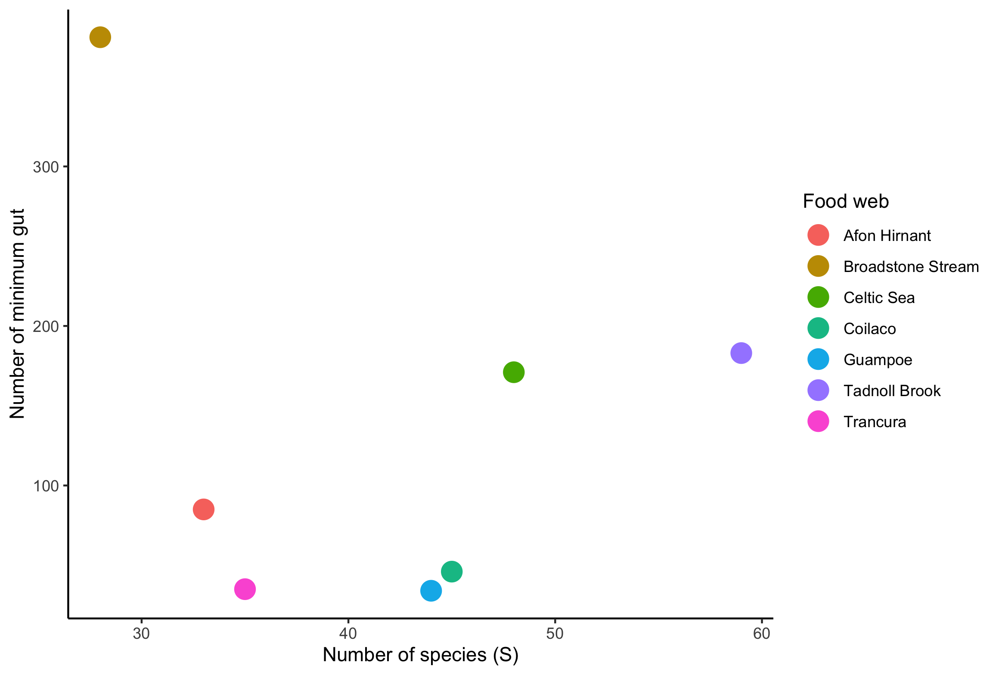
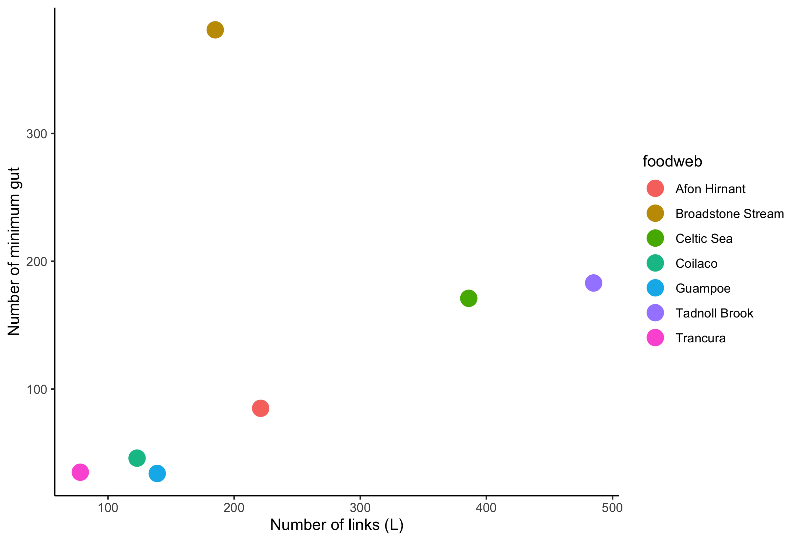
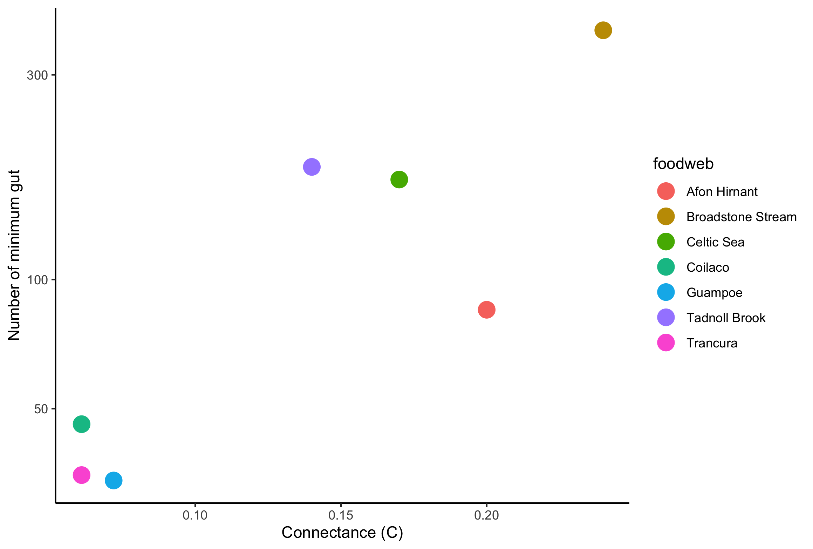
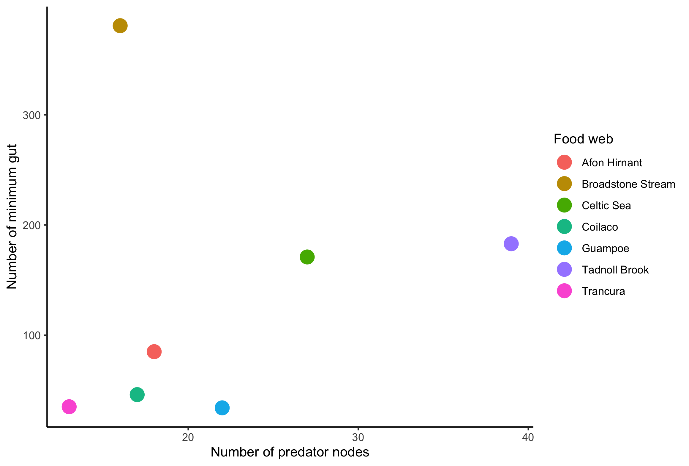
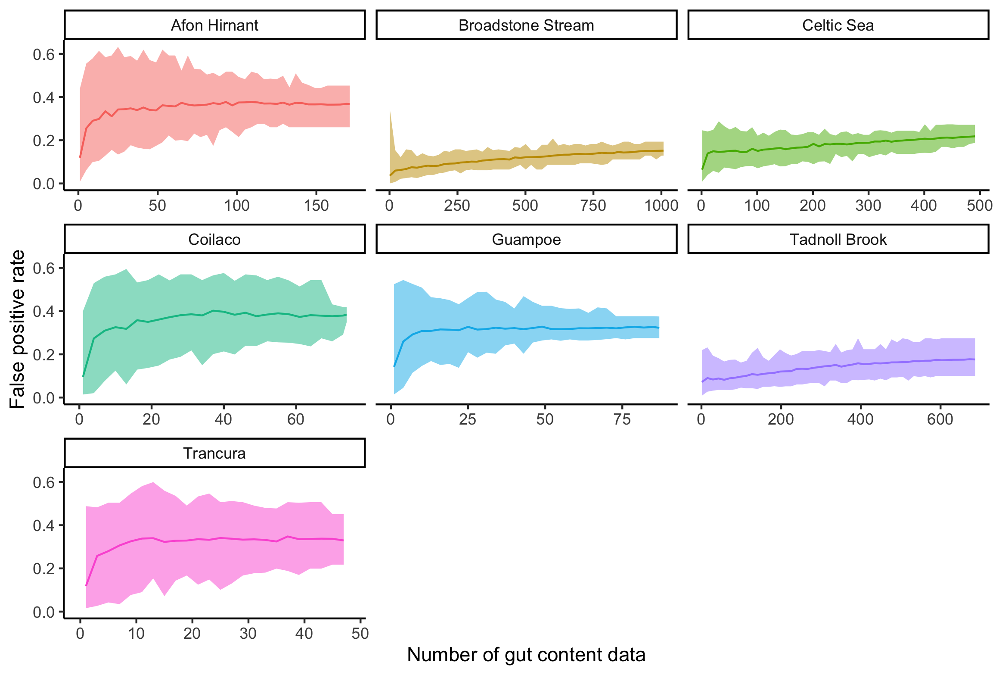
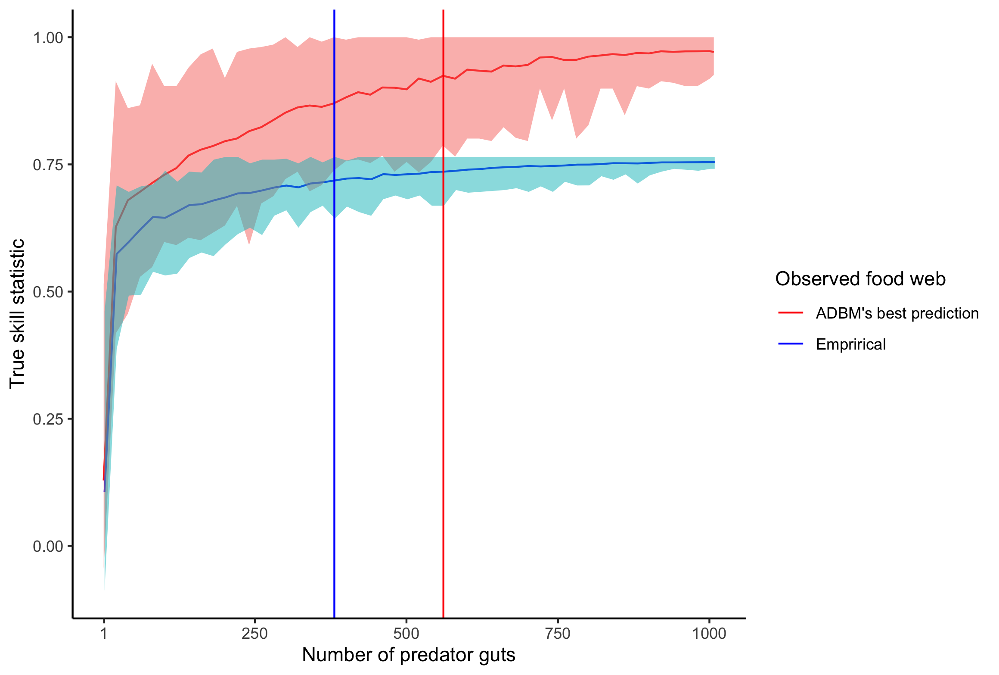

## Q1: Construct a graph with minimum number of gut content data with respect to the number of species.

## Q2: Plot number of false positives in ADBM's prediction with respect to the gut content data

## Q3: Make a list of journals for submission of ms

## Q4: Plot the graphs for a case when the ADBM’s best prediction is the true one

---

## Q1: Construct a graph with minimum number of gut content data wrt number of species.

```{r, echo=FALSE, fig.align='center', out.width="300px", fig.cap=" "}





```

### Preliminary results:

-   There seems to be a positive relation between the number of minimum gut and the predictors (S, L, C and number of predator nodes) in Fig. 1-4 (Broadstone Stream is an outlier in Fig. 1,2 and 4).

## Q2: Plot number of false positives in ADBM's prediction with respect to the gut content data

```{r, echo=FALSE, fig.align='center', out.width="400px", fig.cap=" "}


```

### Preliminary results:

-   The food web with a high false positive rate in Fig. 5 has low true skill statistics.

## Q3: Make a list of journals for submission of ms

-   Methods in Ecology and Evolution (IF = 6.4)\
-   Journal of Animal Ecology (IF = 5)\
-   Food webs (IF = 2.3)


## Q4: Plot the graphs for a case when the ADBM’s best prediction is the true one

Here, we consider a case where the observed (true) food web is assumed to be the best food web simulated using the ADBM. The minimum number of gut content data to achieve 95% of the maximum TSS for the ADBM's best prediction case is higher than that for the empirical case (Fig. 6).

```{r, echo=FALSE, fig.align='center', out.width="500px", fig.cap=" "}


```

