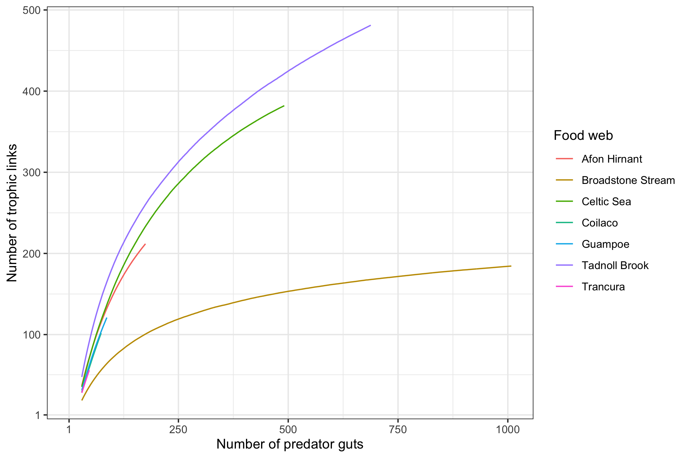
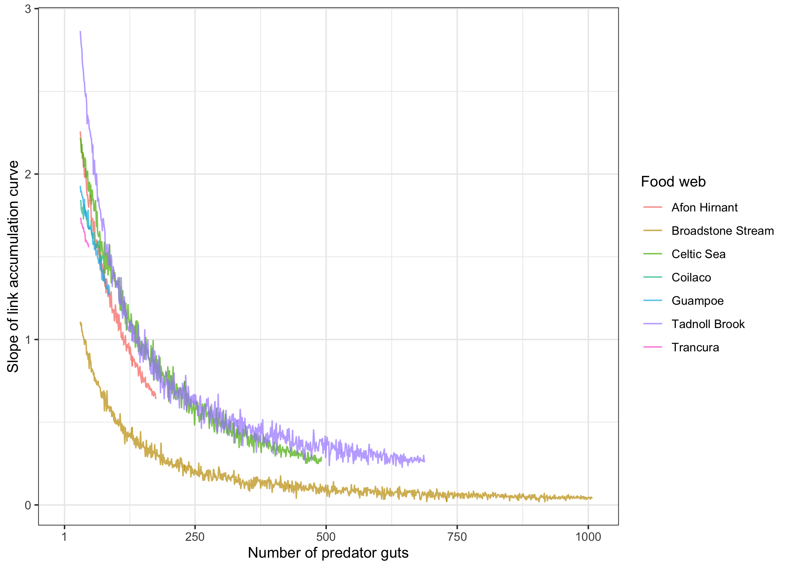
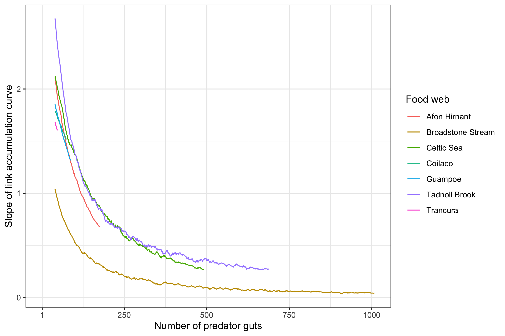
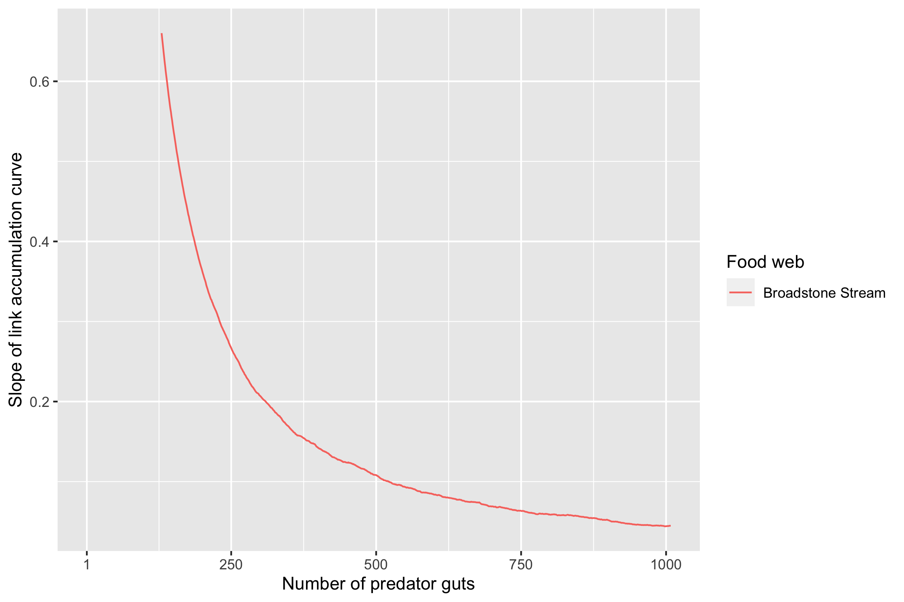
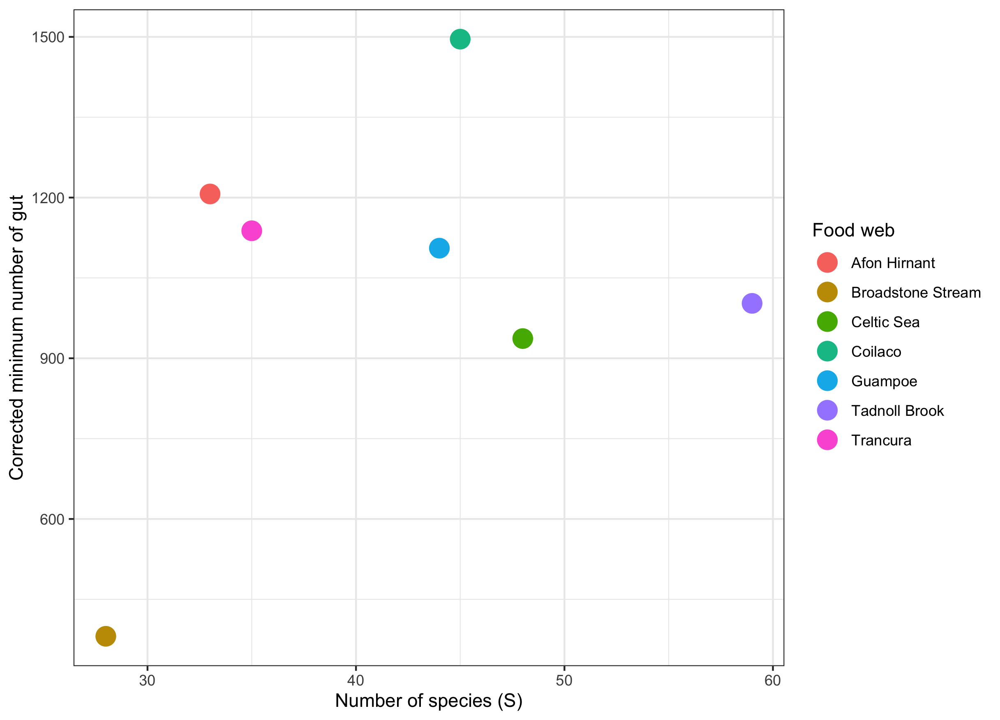
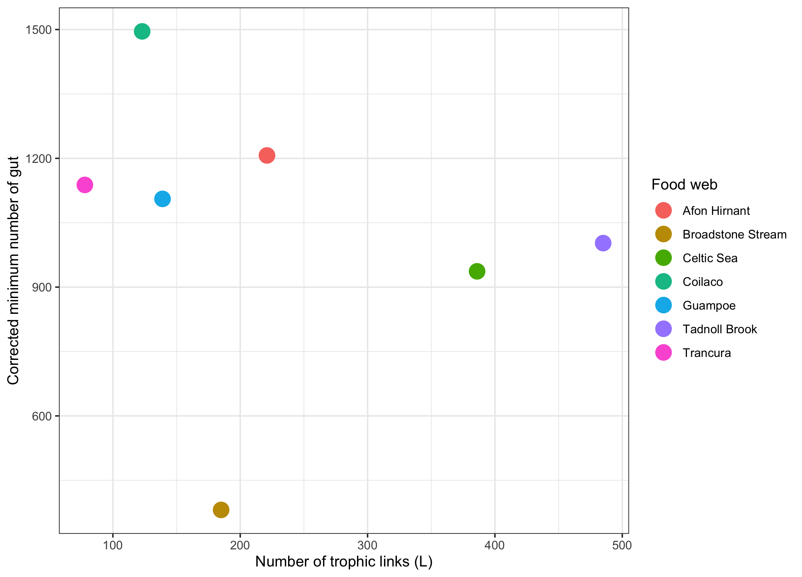
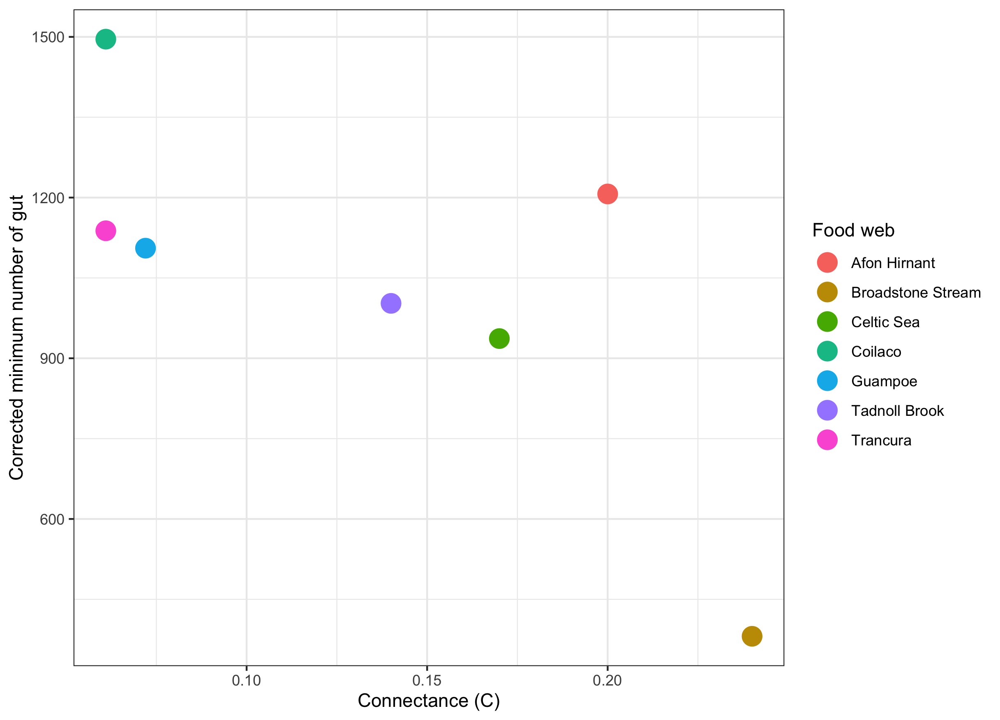

We standardise sampling across food webs.

## Link accumulation curve with respect to the number of predator guts

```{r echo = FALSE, fig.align='center', out.width="600px", fig.cap="Number of trophic links plotted against the number of gut content data for seven food webs."}
knitr::include_graphics("../../../results/misc/plot_emplinks_ngut.png")
```


## Rolling average of link accumulation curve with respect to the number of predator guts

```{r echo = FALSE, fig.align='center', out.width="600px", fig.cap="Rolling average (with window of 30 items) of number of trophic links plotted against the number of predator guts for seven food webs."}

```


## Slope of link accumulation curve with respect to the number of predator guts

```{r echo = FALSE, fig.align='center', out.width="600px", fig.cap="Slope of link accumulation curve plotted against the number of predator guts for seven food webs."}

```


## Rolling average of slope of link accumulation curve with respect to the number of predator guts

```{r echo = FALSE, fig.align='center', out.width="600px", fig.cap="Rolling average (with window of 10 items) of slope of link accumulation curve plotted against the number of predator guts for seven food webs."}

```


## Rolling average of slope of link accumulation curve with respect to the number of predator guts for the Broadstone Stream food web

```{r echo = FALSE, fig.align='center', out.width="600px", fig.cap="Rolling average (with window of 100 items) of slope of link accumulation curve plotted against the number of predator guts for seven food webs."}

```


## Factor 

```{r echo = FALSE}
factor_all <- readRDS("../../../results/misc/factor_all_ngut.RDS")
print(factor_all)
```


## Corrected minimum number of gut vs number of species

```{r echo = FALSE, fig.align='center', out.width="600px", fig.cap="Corrected minimum number of gut vs number of species (S) for seven food webs."}

```


## Corrected minimum number of gut vs number of links

```{r echo = FALSE, fig.align='center', out.width="600px", fig.cap="Corrected minimum number of gut vs number of links (L) for seven food webs."}

```

## Corrected minimum number of gut vs connectance

```{r echo = FALSE, fig.align='center', out.width="600px", fig.cap="Corrected minimum number of gut vs connectance (C) for seven food webs."}

```

