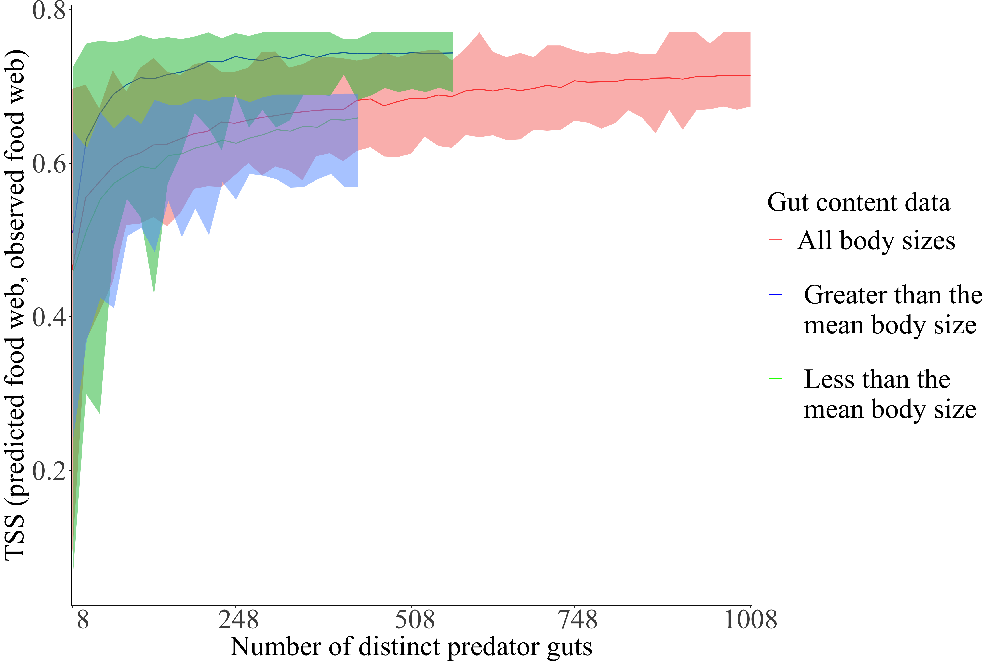
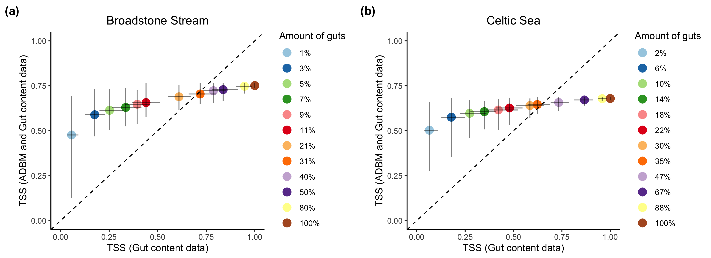
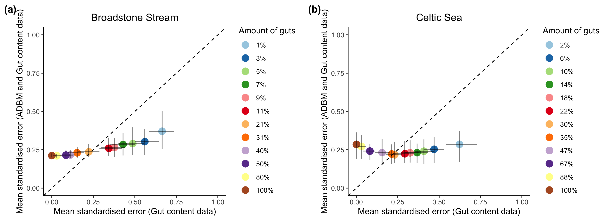

# Supplementary Information

<!-- ```{r, echo=FALSE, fig.align='center', out.width="400px", fig.cap="\\label{fig:fig_s1} \\textit{In silico} approach for investigating the effect of quantity and composition of food web data in predicting food web structure using the ADBM."} -->

<!-- knitr::include_graphics("../fig/flowchart.png") -->

<!-- ``` -->

## Gut content data simulation

<!-- \*\*OP: It needs to be very clear in the main text, and here, why this is being described. It is currently unclear, not least because the main text does not, I think, refer to the information here. [OP: I'm not sure my comment has been addressed. We should discuss this.] [OP: I don't see this Supplement being referred to anywhere in the main text. I would expect it to be.] [OP: I advise to integrate the content of this supplement into the main article. There is not so much of it, and it is insightful.] -->

We simulated a food web using the ADBM for a given set of parameters. For a given set of predators, we subset the diet from the simulated food web. Then using a probability mass function (distribution), we sampled the gut content data from predators' diet thereby incorporating the uncertainty in the gut content data. We repeated this process multiple number of times for every predator in the food web.

*Input:*

-   Predators whose diet are to be simulated $P = \{p_1, \dots, p_n\}$

-   A simulated food web $ADBM(\theta_i) = \{d_{p_1}, d_{p_1}, \dots, d_{p_k}\}$, where $d_{p_k}$ is a one-dimensional diet matrix of predator $k$ containing ones and zeros.

-   A function which describes uncertainty in the diet $U(d)$

-   Number of independent guts to be simulated for a predator $p_i: ngut$

*Sampling:*

-   for $p_i \in P$

    -   for $j = 1, \dots, ngut$, where $ngut$ is the number of guts to be simulated

        -   Simulate a single gut of a predator $p_i: g(p_i) = d_{p_i} * U(d_{p_i})$

    -   Set of gut of a predator $p_i: G(p_i) = \{ g(p_i) : g(p_i) = d_{p_i}*U(d_{p_i}) \}$

*Output:*

-   We simulated a pool of gut content data which contains simulated gut content data $G(p_i)$ for every predator $p_i$

## Prediction using gut content data from a simulated food web

```{r fig_r0, echo=FALSE, fig.align='center', out.width="400px", fig.cap="\\label{fig:fig_r0} True skill statistics between predicted food web and observed food web for a simulated small reef food web estimated for distinct predator guts in a sample. The observed simulated food web consists of 50 species and \\dots links. The vertical bars correspond to the prediction intervals of the true skill statistics with filled circles representing the corresponding mean. A prediction interval of the TSS is formed using a set of 100 accepted TSS values using the ABC method."}
knitr::include_graphics("../fig/TSS_with_n_pred_prop_simulated.png")
```

The true skill statistics (TSS) between the predicted food web and simulated observed food web saturated with an increasing number of distinct predator guts in a sample (Fig. \ref{fig:fig_r0}). The TSS of the predicted food webs estimated using the complete individual gut data had narrower prediction intervals resulting in less uncertainty, and higher mean TSS than that using the partial individual gut data. The maximum limit of the prediction interval of TSS estimated using the complete gut data and the partial gut data were almost equal, with the minimum limit of the prediction interval of TSS using partial gut data being lower than that from the complete gut data. Eventually, the gap between the mean TSS using the partial gut data and the complete gut data reduced with an increasing number of distinct predator guts. This suggests that when there is enough predator species' gut data, the achieved TSS was almost constant and hence independent of the amount of gut data.

The maximum TSS estimated using the complete gut data was very close to one and almost remained constant with an increasing number of different predator species sampled. With the gut data sample of only five distinct predator species, 95% of the maximum mean TSS was achieved when complete individual gut data was used, while the same was achieved with 15 predator species for partial gut data. This shows that one does not need to know the gut data of all the species to predict the food web and the accuracy is dependent on the completeness of an individual gut data.


<!-- ```{r fig_r3, echo=FALSE, fig.align='center', out.width="300px", fig.cap="\\label{fig:fig_r3} True skill statistics between predicted food web and observed food web estimated for different number of distinct predator guts. The estimation is done for three sets of gut data: gut content data of predators whose body sizes are smaller than the mean body size, larger than the mean body size, and all the gut content data."} -->
<!--  -->
<!-- ``` -->


<!-- ```{r fig_r31, echo=FALSE, fig.align='center', out.width="500px", fig.cap="\\label{fig:fig_r31} True skill statistic between predicted food web using ADBM and incomplete gut content data, and observed food web against the true skill statistic between food web constructed using incomplete gut content data, and observed food web. Error bars represent prediction intervals of 100 independent samples. Dashed line is 1:1 line for reference."} -->
<!--  -->
<!-- ``` -->


<!-- ```{r fig_r32, echo=FALSE, fig.align='center', out.width="500px", fig.cap="\\label{fig:fig_r32} Mean standardised error in structural properties in the food web predicted using ADBM and incomplete gut content data against structural properties in the predicted food web constructed using incomplete gut content data. Error bars represent prediction intervals of 100 independent samples. Dashed line is 1:1 line for reference."} -->
<!--  -->
<!-- ``` -->


```{r echo=FALSE, fig.align='center', out.width="400px", fig.cap="\\label{fig:fig_rc} Link accumulation curve of the food web constructed using gut content data plotted against number of gut content data."}
knitr::include_graphics("../../results/misc/plot_emplinks_ngut.png")
```

<!-- # Notes: -->

<!-- ## Stable isotope ratios -->

<!-- * Isotope ratios are reported in parts per thousand  relative to standards, and atmospheric N for nitrogen, and defined in delta notation as -->

<!-- * $\delta^{15}N$ or $\delta^{13}C = (\frac{R_{sample}}{R_{standard}} - 1) * 10^3 $ -->

<!-- * Most commonly a fixed $\Delta^{15}N$ value of 3.4 ppt is used to estimate relative species TP -->

<!-- # Other notes: -->

<!-- * Audience: Researchers who are interested in food web data collection -->

<!-- # References -->

<!-- ## Why knowing trophic interactions is important? -->

<!-- Knowledge about the trophic interactions in a food web can be used to answer crucial ecological questions: Which species is a keystone species in a food web [@jordanKeystoneSpeciesFood2009]? How would a food web respond if the top predators are removed [@knightTrophicCascadesEcosystems2005]?  Which species should be given priority when conservation efforts are implemented [@mcdonald-maddenUsingFoodwebTheory2016]? How robust is a food web to extinctions [@dunneNetworkStructureBiodiversity2002]? -->

<!-- ## What are the methods for knowing interactions? -->

<!-- Species interactions can be directly or indirectly inferred from different types of methods such as gut content analysis [@peralta-maraverStructureDynamicsStability2017], stable isotope ratio analysis of tissues [@laymanCanStableIsotope2007], experimentation [@warrenSpatialTemporalVariation1989], DNA metabarcoding [@roslinUseDNABarcodes2016], food web model [@gravelInferringFoodWeb2013; @petcheySizeForagingFood2008; @williamsSimpleRulesYield2000] and literature research [@grayJoiningDotsAutomated2015; @cohenSoilInvertebratesChemistry2014; @goldwasserConstructionAnalysisLarge1993a]. -->

<!-- ## What are the shortcomings of the methods mentioned above? -->

<!-- These food web methods mentioned above have multiple shortcomings. Stable isotope ratio analysis of the organism's tissue does not give a direct information of the diet of that organism but rather approximate trophic position of that species in the food web. Although mixing models can be used to determine what prey items are most likely fed upon by a predator but this results in uncertainty in the estimates [@kadoyaIsoWebBayesianIsotope2012; @crawfordApplicationsStableIsotope2008]. Experimentation (e.g. feeding trials) may create unrealistic conditions where a predator is confined in a small space with a potential "prey" and is effectively "forced" into eating it (citreqd). DNA metabarcoding could have many issues such as failure to relate OTUs to species, or inability to distinguish secondary predation, i.e. the DNA signature of the prey consumed by the prey consumed by the primary item found in the predator's gut. Another approach to infer missing links is literature research which involves assuming that a link will occur because another author described it in some other system, or for related predator/prey species, e.g. from the same genus or family  [@grayJoiningDotsAutomated2015; @cohenSoilInvertebratesChemistry2014; @goldwasserConstructionAnalysisLarge1993a] (citreqd). This typically results in a food web that will be very oversampled with false positives in the presence of links (citreqd). -->

<!-- ## Food web model -->

<!-- Food web models are set of rules governed by ecological theory which defines trophic interactions in a food web. Along with inferring missing links in a food web, they can be used for understanding the mechanistic of the food web and ecological forecasting. Observed food web data can be used to parameterise the food web model. -->

<!-- ## Parameterising a food web model using food web data -->

<!-- One of the common method of knowing presence-absence information of trophic links in food web is by gut content analysis of predator guts, which can be used to parameterise a food web model. Gut content data have been used to predict the diet of a predator in a food web [@eitzingerTestingValidityFunctional2018; @omalleyEffectsFoodWeb2017; @dixonAssessingDietNorth2017; @mcclain-countsTrophicStructureMesopelagic2017b; @peralta-maraverStructureDynamicsStability2017]. A single gut content data of a predator gives the information what the predator has consumed recently. The diet of that individual can be inferred from the items in the stomach. -->

<!-- ## Why inferring interactions is not easy? -->

<!-- As a food web can be quite complex with many species and trophic interactions [@williamsSimpleRulesYield2000;@berlowSimplePredictionInteraction2009], inferring these trophic interactions with high accuracy and low uncertainty would require a large amount of food web data (citreqd). E.g. One would need to sample many individuals for gut content data, and processing these guts require a large amount of effort and time as well. -->

<!-- A single gut content of a predator provides information of the prey individuals that have been consumed by the predator in a small temporal and spatial scale (citreqd). Therfore, given a spatial and temporal scale of a food web, the sampling of the gut content data needs to be carried out. This means that for a food web constructed on a large spatial and temporal scale large number of gut content data needs to be collected. There is also a possibility that some of the information provided by these types of food web data are redundant i.e. taking into account any further food web data does not necessarily increase the food web prediction significantly. E.g. This can happen if the guts of two predator individuals give the same information about the prey the predator has consumed. This issue can be resolved by using a yield-effort curve which suggests when sampling of new predator guts can be stopped [@hernandezParasitesAlterTopology2008]. -->

<!-- ## Undersampled food web -->

<!-- When it is difficult to obtain food web data, this can result in missing links in the food web thereby resulting in an undersampled food web. Limitations of resources and time can also lead to an undersampled food web because collecting and analysing gut content data is tedious and expensive task (citreqd). It is crucial to have well sampled food web because food web properties are highly sensitive to varying levels of sampling effort [@goldwasserSamplingEffectsEstimation1997]. So, it is important to predict food web properties with high accuracy and high precision. -->

<!-- ## What is a food web model and how can it be used to compensate for undersampling? -->

<!-- When we have an undersampled food web, food web models can be used to predict which trophic interactions are feasible and which are not [@allesinaGeneralModelFood2008; @cohenStochasticTheoryCommunity1985; @gravelInferringFoodWeb2013; @petcheySizeForagingFood2008; @tamaddoni-nezhadConstructionValidationFood2013]. Food web model are set of rules governed by ecological theory which defines trophic interactions in a food web. For example, @petcheySizeForagingFood2008 based on foraging traits allometrically scaled using body size data of species predicted trophic interactions where the model was parameterised using known presence and absence of trophic interactions. -->

<!-- ## Research question -->

<!-- How much gut content data is required when a food web model is used to predict trophic interactions? We are interested in maximizing the accuracy and precision of the predicted food web and simultaneously minimizing the amount of gut content data used, because we do not want to spend a lot of resources in sampling gut content data. -->

