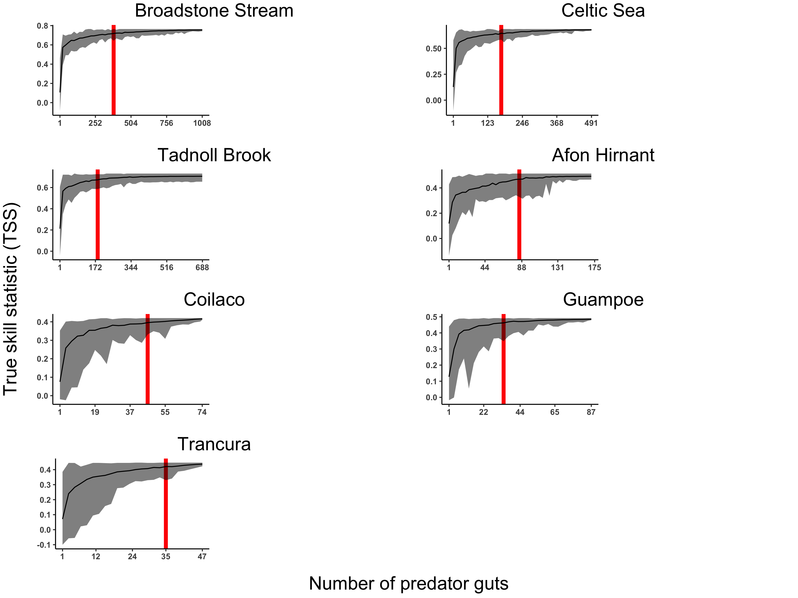
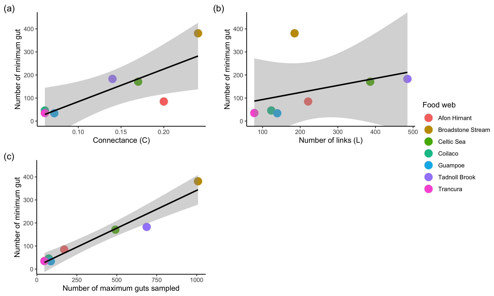
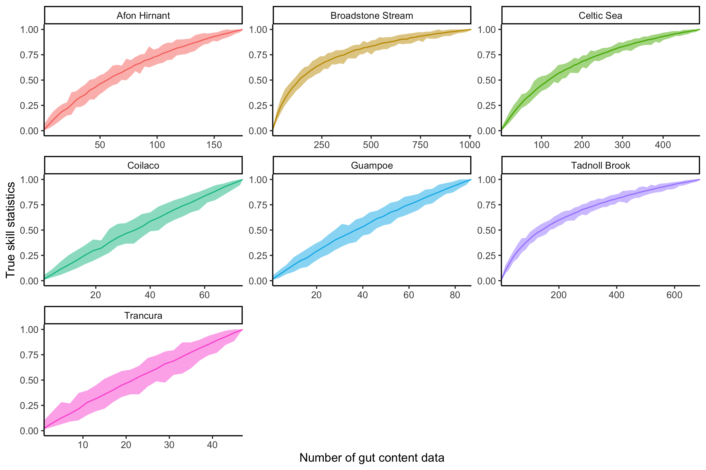
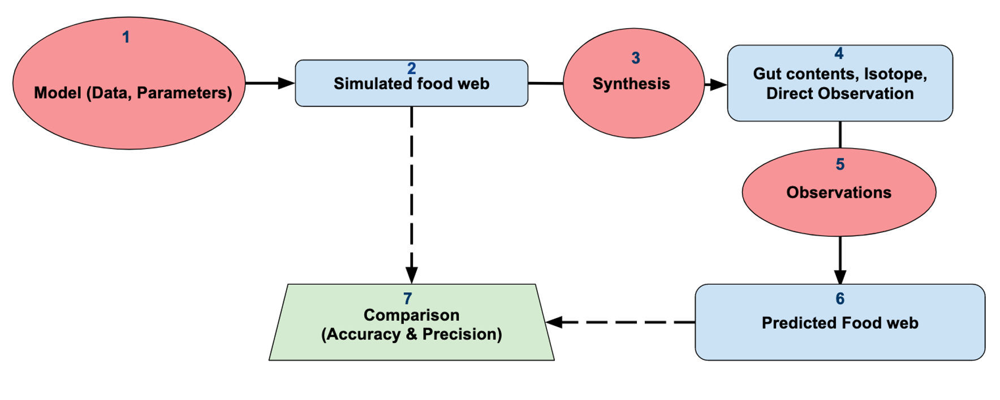
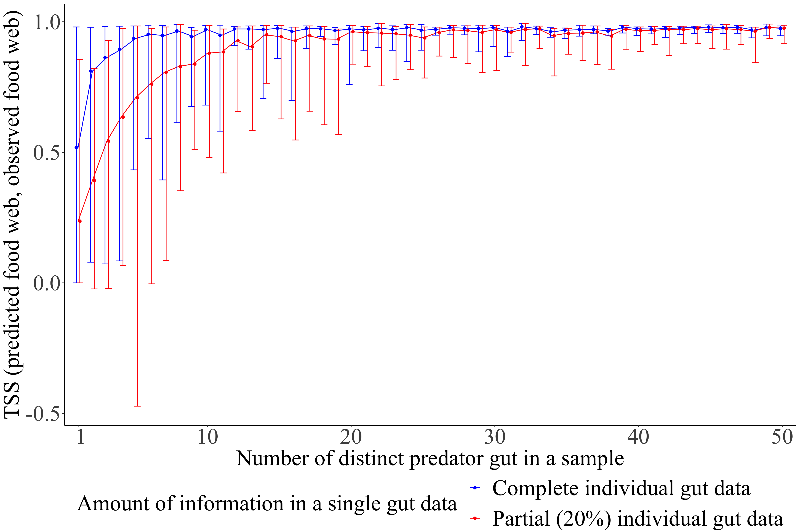
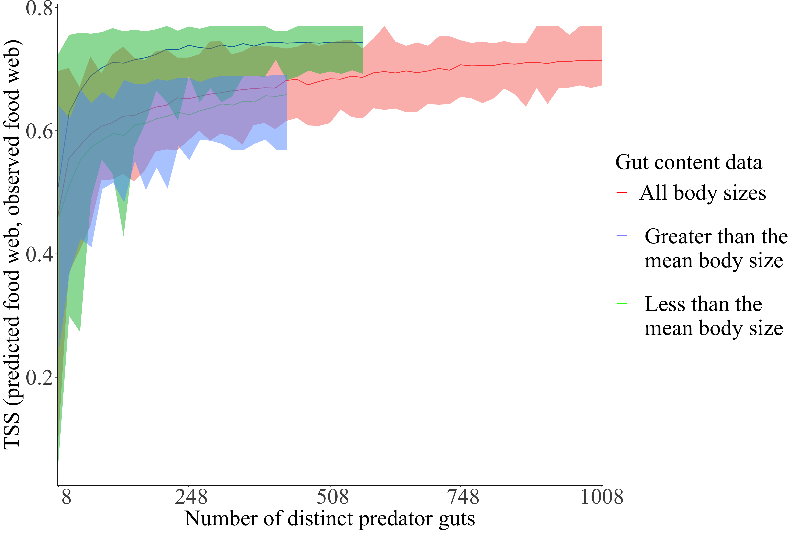
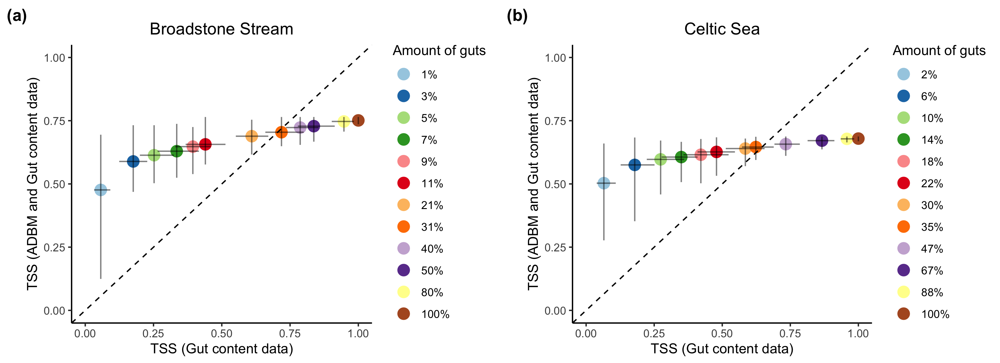
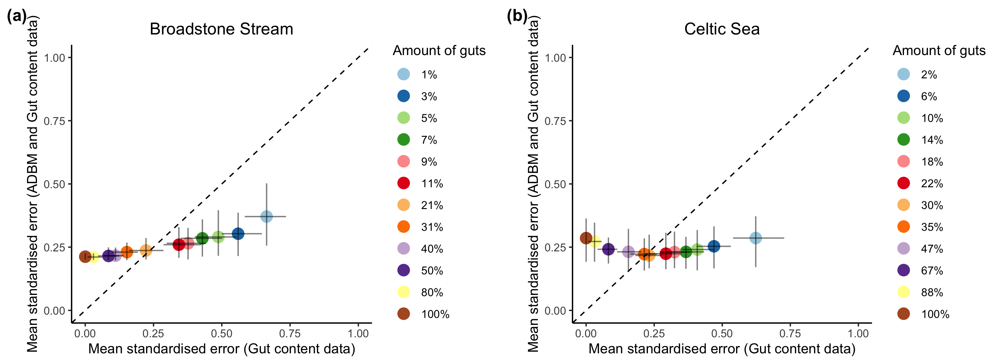

# Alternate titles

-   Predicting trophic interactions using incomplete gut content data

-   Effect of the amount of gut content data on the accuracy and precision of food web prediction

# Introduction

Knowledge about the trophic interactions in a food web is crucial in ecology from identifying keystone species [@jordanKeystoneSpeciesFood2009] to quantifying robustness of a food web to species extinctions [@dunneNetworkStructureBiodiversity2002]. This has led to the development of numerous food web models [@allesinaGeneralModelFood2008; @cohenStochasticTheoryCommunity1985; @gravelInferringFoodWeb2013; @petcheySizeForagingFood2008; @tamaddoni-nezhadConstructionValidationFood2013]. Along with inferring missing links in an observed food web, the food web models are also used for ecological forecasting [@hattabForecastingFinescaleChanges2016; @lindegrenEcologicalForecastingClimate2010] and understanding the underlying mechanism governing the interactions in a food web [@ogormanSimpleModelPredicts2019].

Although food web models are constructed using prior theory governing the food webs, interaction data is required to parameterise a model. For example, @petcheySizeForagingFood2008 used presence-absence information about trophic interactions to parameterise the allometric diet breadth model and thereby predict species interactions. These information can be inferred from diverse set of methods such as gut content analysis [@peralta-maraverStructureDynamicsStability2017], stable isotope ratio analysis of tissues [@laymanCanStableIsotope2007], experimentation [@warrenSpatialTemporalVariation1989], DNA metabarcoding [@roslinUseDNABarcodes2016] and literature research [@grayJoiningDotsAutomated2015; @cohenSoilInvertebratesChemistry2014; @goldwasserConstructionAnalysisLarge1993a]. All of these methods can infer the diet of a consumer, however different methods measure different consumed components, thereby resulting in different levels of uncertainty in the inferred diet (citreqd). A single gut content of a predator describes what that individual has consumed recently which can be used to infer the diet of the predator [@eitzingerTestingValidityFunctional2018; @omalleyEffectsFoodWeb2017; @dixonAssessingDietNorth2017; @mcclain-countsTrophicStructureMesopelagic2017b; @peralta-maraverStructureDynamicsStability2017]. Stable isotope data when combined with mixing models can be used to determine which prey items are most likely fed upon by a predator [@kadoyaIsoWebBayesianIsotope2012; @crawfordApplicationsStableIsotope2008].

Acquiring food web data from these methods is time consuming and expensive (reference). For example, many gut content data needs to be collected to infer the complete presence-absence information of a food web structure with high accuracy and precision. Also further time and resource investment is required to process the collected samples. Hence, there is an utmost demand to know the minimum number of presence-absence information of a food web to parameterise a food web model with high accuracy and high precision, so that one knows when to stop collecting any further data on the food web.

The key question we are interested in answering is how much presence-absence information is required to infer food web structure from a food web model with high accuracy and high precision. In other words, in case of gut content data how many samples of gut content should one collect from the field to parameterise a food web model? To answer this question, we use the presence-absence information from gut content data, and allometric diet breadth model (ADBM) to predict trophic interactions. We parameterise the model using approximate Bayesian computation/rejection Monte Carlo sampling.

```{r echo = FALSE, warning = FALSE}
# options(knitr.kable.NA = '')
# library(readxl)
# library(knitr)
# library(kableExtra)
# fw_table <- read_excel("../table/data_summary_fil.xlsx")
# 
# kable(fw_table, format = "latex",
#       caption = "\\label{fig:tab_1}Studies showing the type of data used to infer trophic interactions in a food web",
#       escape = FALSE) %>%
#     kable_styling(latex_options="scale_down")


```

# Materials and Methods

In the upcoming sections, we present the allometric diet breadth model (ADBM) and the gut content data used to infer trophic interactions. We also give a detailed account of using partial gut content data to parameterise the ADBM using approximate Bayesian computation (ABC). We assessed model predictions using true skill statistic and various structural food web properties for comparison across food webs.

## Allometric Diet Breadth Model (ADBM)

The allometric diet breadth model (ADBM) is based on optimal foraging theory, specifically the contingency foraging model [@macarthurOptimalUsePatchy1966]. The ADBM predicts the set of prey species a consumer should feed upon to maximise its rate of energy intake [@petcheySizeForagingFood2008]. The foraging variables in the model: energy content of the resources, handling times of the prey, space clearance rate and prey densities are allometrically scaled to the body sizes of the species.

## Broadstone Stream

Broadstone Stream (51$^\circ$ 05' N 0$^\circ$ 03' E; 120 m above sea-level) is a second-order tributary of the River Medway in south-east England. It is dominated by invertebrates as the acidity of the stream (pH 4.7-6.6) excludes fish. The stream consists of 25 common invertebrate species [@woodwardQuantificationResolutionComplex2005]. Among the predators, the three large species are *Cordulegaster boltonii* Donovan, *Sialis fuliginosa* Pict. and *Plectrocnemia conspersa* [Curtis] and the three small species are the larvae of the tanypod midges *Macropelopia nebulosa* [Meigen], *Trissopelopia longimana* [Staeger], and *Zavrelimyia barbatipes* [Kieffer]. Broadstone Stream food web is one of the most completely described food webs available for any system [@schmid-arayaImportanceMeiofaunaFood2002; @hildrewChapterSustainedResearch2009; @layerFoodWebStructure2010; and @woodwardQuantificationResolutionComplex2005a].

## Celtic Sea

The Celtic Sea is an area of continental shelf bordered by Ireland, the UK and the Bay of Biscay. Precise sampling locations and dates were not given in the Barnes et al. (2008) dataset, from where the data used in this chapter were extracted, so we pooled data over the whole time period and locations to capture general patterns. Only locations consistently sampled through the 1987--2001 time series were used (Blanchard et al., 2005).

The feeding links of fishes in the Celtic Sea have been described in a published global dataset of individual predator and prey body sizes and taxonomy (Barnes et al., 2008): in total, 1988 feeding events from 29 predator species were included in the food web presented here. The original stomach contents data were collected from dissections carried out on board research vessels during the annual surveys carried out by the Centre for Environment, Fisheries and Aquaculture Science (Cefas) (Pinnegar et al., 2003). Predator and prey length were recorded and converted to body mass by Barnes et al. (2008) using published regression equations. Only vertebrate prey were identified and measured, with the vast majority being identified to species.

## Afon Hirnant

The Afon Hirnant is a tributary of the Welsh Dee in North Wales, U.K. (52$^\circ$ 52'N 03$^\circ$ 34) with the study being conducted at three sites. The pH within each site ranged from about 5.5 to 7 over the course of the year.

A total of 180 invertebrate samples were collected for the whole sampling periods. All individuals within the benthic samples were counted and identified to the lowest possible taxonomic level (usually species). Prey items were identified using a combination of taxonomic keys and reference slides of previously identified species, after @schmid-arayaConnectanceStreamFood2002; @schmid-arayaImportanceMeiofaunaFood2002.

## Tadnoll Brook

Description of Tadnoll Brook here

## Coilaco

Description of Coilaco here

## Guampoe

Description of Guampoe here

## Trancura

Description of Trancura here

## Food web construction

Presence and absence interactions of food web data can be aggregated in different ways [@gilljamSeeingDouble2011]. A common way of aggregating food web data is the taxonomic approach, where a species is defined as predating on another if at least one prey species individual was found in the gut of a predator species individual. Whereas in size-class food web, a feeding link was assigned if at least one prey item within a size class was found in the gut of a predator of another size class, irrespective of their taxonomy. In our study, we aggregate the food web on the basis of size class.

## Assessment of prediction

The accuracy of the predicted diet of the predators was defined using true skill statistic (TSS) which takes into account the true and false predictions of both the presence and absence of links defined as:

$$ \text{TSS} = \frac{ad-bc}{(a+c)(b+d)} $$ where $a$ is the number of observed links that are predicted by the model (true positives), $d$ is the number of observed absences of links that are correctly predicted (true negatives), $b$ is the number of false positives, and $c$ is the number of false negatives.

The $TSS$ ranges from $-1$ to $1$, where +1 indicates a perfect prediction. A $TSS$ value of zero or less indicates a performance no better than random [@alloucheAssessingAccuracySpecies2006].

## Inferring food web using partial gut content data

From a pool of gut content data, we draw a set of gut content data randomly. Then we used the rejection ABC to accept a parameter value from a prior distribution which would have resulted in the minimum distance, where distance = 1 - True skill statistic. The true skill statistic was computed between the predators' diet predicted from the ADBM, and that from the sampled gut content data. We repeated this process for $n~(= 100)$ number of times for every $i$ number of guts, where $i$ lies between 1 and total number of gut content data in the pool.

*Input:*

-   Predators $P: P = \{p_1, p_2, \dots, p_k \}$

-   A pool of gut content data $G: G = \{g_1, g_2, \dots, g_n\}$, where $g_{n}$ is a one-dimensional matrix containing ones and zeros.

-   A model prediction $model(\theta): ADBM(\theta) = \{d_{p_1}, d_{p_1}, \dots, d_{p_k}\}$, where $d_{p_k}$ is a one-dimensional diet matrix of predator $k$ containing ones and zeros.

-   A summary statistic $s(x): s(x) \subseteq model(\theta)$

-   A distance function $d(x_i, y) : d(x_i,y) = 1 - TSS(x_i, y)$

-   An observed food web $Y: Y = \{d_{p_1}', d_{p_1}', \dots, d_{p_k}'\}$

*Sampling:*

for $i = 1, \dots, tgut$ where $tgut$ is the total number of gut content data in the pool $G$

-   for $j = 1, \dots, nsample$ where $nsample$ is the number of independent samples to be drawn

    -   Draw a set of gut content data $y = \{g_1, g_2, \dots, g_i\}$ from the pool of gut content data $G$

    -   for $k = 1, \dots, npar$ where $npar$ is the number of parameter values to be sampled

        -   Draw a set of parameter values $\theta_k$ from the prior distribution $\pi(\theta)$

        -   Compute the model result $x_i = model(\theta_k)$

        -   Compute $s(x_i)$ and $d(s(x_i), y)$

    -   Accept $\theta_j$, which results in the $min_i\{d(s(x_i), y)\}$

-   Compute $TSS_{i}(x, y) = \{TSS(x_i,y): x_i = ADBM(\theta_j), \theta_j \text{ computed from previous step}\}$ using the accepted $\theta_1, \dots, \theta_{nsample}$

*Output:*

A prediction interval containing $TSS$ between observed and predicted food webs for every $i$ number of gut content data drawn from the pool of gut content data.

# Results

We first present how the accuracy of the food web model vary in predicting trophic interactions when we increase the amount the gut content data provided to the food web model. Then, we calculate the number of gut content data for each food webs corresponding to which the accuracy results in 90% of the maximum true skill statistics predicted by the food web model. We also compute the goodness of the food web model in predicting structural properties from incomplete gut content data. We did that by computing mean standardised error in food web properties.

## Inferring trophic interactions using ADBM and incomplete gut content data

```{r, echo=FALSE, fig.align='center', out.width="500px", fig.cap="\\label{fig:fig_ra} (a, c, e, g, i, k, m) Accuracy of the predicted food web measured using the true skill statistics, predicted by the ADBM parameterised using gut content data. Line and shaded grey region represents the mean and the prediction interval of 100 independent samples respectively. Red line represents the number of predator guts required to achieve a TSS of 95\\% of the maximum TSS. (b, d, f, h, j, l, n) Ratio of the true skill statistic of the predicted food web by the ADBM parameterised using gut content data to that of the predicted food web constructed using gut content data only. The dashed line shows where the ratio is one for reference."}

```

The true skill statistics of the food webs predicted by the ADBM using subsets of gut content data improved quickly for lower number of predator guts (Fig. \ref{fig:fig_ra}) (a, c, e, g, i, k, m). The prediction interval of the true skill statistics reduced with the increasing number of predator guts with the mean TSS asymptoting to the maximum mean TSS achieved by the ADBM when all the gut content data was used. Although the maximum TSS varied among the food webs, the qualitative increase in the TSS was the same.

For a low number of predator guts, the TSS of the model predicted food web was higher compared to the TSS of the food web constructed from gut content data (Fig. \ref{fig:fig_ra} (b, d, f, h, j, l, n)), recommending when a model can be used to compensate for undersampled links. After a certain increase in the number of predator guts, the ratio TSS(Model)/TSS(data) reduced to less than one, and reduced further gradually.

With only 381 number of gut content data which is 38% of the total gut content data, the ADBM predicted the food web with TSS of 0.74 which was 95% of the mean TSS (0.78) achieved using complete gut content data by the ADBM for Broadstone Stream food web (Fig. \ref{fig:fig_ra}(a)). In the case of the Celtic Sea food web, only 171 gut content data was required by the ADBM to predict food web with TSS equal to 95% of the mean TSS (0.68) achieved using complete gut content data by the ADBM (Fig. \ref{fig:fig_ra}(c)).

## Dependence of minimum gut content data on number of species, links and connectance

There seems to be a positive relationship between number of minimum gut content data and number of species (S) (Fig. \ref{fig:fig_rb} (a)), links (L) (Fig. \ref{fig:fig_rb} (c)), connectance (C) (Fig. \ref{fig:fig_rb} (d)) and number of predator nodes (Fig. \ref{fig:fig_rb} (e)), with Broadstone Stream being an outlier in Fig. \ref{fig:fig_rb} (a, c, e). The number of minimum gut content data increases with number of maximum gut content data sampled (Fig. \ref{fig:fig_rb} (b)). There seems to be a negative relationship between proportion of minimum gut (= Number of minimum gut / Number of maximum guts sampled) and number of species (S) (Fig. \ref{fig:fig_rb} (f)), links (L) (Fig. \ref{fig:fig_rb} (g)), connectance (C) (Fig. \ref{fig:fig_rb} (h)).

```{r echo=FALSE, fig.align='center', out.width="500px", fig.cap="\\label{fig:fig_rb} (a, b, c, d, e) Number of minimum gut content data plotted against number of species (S), number of maximum guts sampled, number of links (L), connectance (C) and number of predator nodes respectively. (f, g, h) Proportion of minimum gut content data plotted against number of species (S), number of links (L) and connectance (C) respectively."}

```

```{r echo=FALSE, fig.align='center', out.width="500px", fig.cap="\\label{fig:fig_rc} True skill statistics of the food web constructed using gut content data plotted against number of gut content data."}

```

# Discussion

<!-- We have demonstrated how a food web model can be used to predict food web in the availability of incomplete data. At lower amount of gut content data, ADBM is quite better at predicting trophic interactions. We also compute the upper limit of amount of gut content data till when it is advantageous to use the ADBM. This can help us decide how much gut content data to actually collect when we are using a food web model to infer trophic interactions. -->

## Why Broadstone Stream is an outlier?

Broadstone Stream is the most sampled food web compared to all the other food webs (Fig. \ref{fig:fig_rc}), which means the observed Broadstone Stream food web might be more accurate compared to others.

## Why incomplete gut content data can be used to infer trophic interactions?

-   Model fills up the missing interactions

-   Partial data helps to constrain the parameter space

<!-- Food web model is set of rules based on ecological theory which defines trophic interactions in a food web. A food web model does better in predicting trophic interactions provided the trophic interactions in an ecosystem is governed by these rules.  -->

## There is uncertainty in gut content data and needs to be propagated into model's predictions

There is considerable uncertainty involved in gut content analysis [@bakerFishGutContent2014] such as in fish's guts, there are sometimes loose tissues that are not identifiable and cannot be assigned to a specific prey item with certainty. There are factors such as sample size of consumers, mechanical prey handling, differential digestion and evacuation rates of different prey types and volumes, and the ingestion order that in combination result in an unquantifiable error which is difficult to interpret in the predator diet [@hyslopStomachContentsAnalysis1980; @rindorfBiasEstimatingFood2004; @bakerFishGutContent2014]. Therefore, a future development would be to consider how this uncertainty is propagated into food web prediction.

## Comparing our study with other studies of predicting food webs using incomplete data

Some studies have presented how the accuracy of food web prediction change when we vary the amount of food web data [@grayJoiningDotsAutomated2015].

## What is the generalisability of our results?

-   Dependent on how size structured a food web is, how the food web is aggregated, the type of interactions

<!-- The model correctly predicted a greater proportion of links when the trophic interactions were more strongly dependent on size [@petcheySizeForagingFood2008]. Indeed, constructing a food web based only on body size (i.e. ignoring taxonomy) resulted in almost twice the number of correctly predicted links, i.e. 83%, in contrast to taxonomy [@woodwardChapterIndividualBasedFood2010]. The goodness of fit of the ADBM's predictions depends on the types of interactions in the food webs [@petcheySizeForagingFood2008], because some of the interactions are more size structured than other interactions. For instance, predacious and aquatic herbivore interations were predicted better than parasitoid and herbivory ones [@petcheySizeForagingFood2008]. -->

## Assumption that the food web constructed with the total gut content data is the true food web and how can this be improved

Our study is based on the assumption that the food web constructed using the complete gut content data is the true food web. However, it might not be the case as the links are still under-sampled for many nodes [@woodwardIndividualBasedFoodWebs2010]. This could result in a lower TSS of the predicted food web from the model which can lead to a higher upper limit on the amount of gut content data.

## Limitation of the model

The maximum predictive power of a model is constrained by the rules it is based on.

## How can we include other food web data type?

A future prospect would be to include other types of food web data

-   experimentation (feeding trials)

-   DNA Metabarcoding

## Extending the approach to other food web models

-   Current approach could be implemented with other food web models

<!-- We have used rejection ABC to make use of incomplete gut content data to parameterise the ADBM. In theory, the ADBM could be replaced with any other food web models that predicts presence and absence interactions. -->

# Conclusion

# Supplementary Information

<!-- ```{r, echo=FALSE, fig.align='center', out.width="400px", fig.cap="\\label{fig:fig_s1} \\textit{In silico} approach for investigating the effect of quantity and composition of food web data in predicting food web structure using the ADBM."} -->

<!--  -->

<!-- ``` -->

## Gut content data simulation

We simulated a food web using the ADBM for a given set of parameters. For a given set of predators, we subset the diet from the simulated food web. Then using a probability mass function (distribution), we sampled the gut content data from predators' diet thereby incorporating the uncertainty in the gut content data. We repeated this process multiple number of times for every predator in the food web.

*Input:*

-   Predators whose diet are to be simulated $P = \{p_1, \dots, p_n\}$

-   A simulated food web $ADBM(\theta_i) = \{d_{p_1}, d_{p_1}, \dots, d_{p_k}\}$, where $d_{p_k}$ is a one-dimensional diet matrix of predator $k$ containing ones and zeros.

-   A function which describes uncertainty in the diet $U(d)$

-   Number of independent guts to be simulated for a predator $p_i: ngut$

*Sampling:*

-   for $p_i \in P$

    -   for $j = 1, \dots, ngut$, where $ngut$ is the number of guts to be simulated

        -   Simulate a single gut of a predator $p_i: g(p_i) = d_{p_i} * U(d_{p_i})$

    -   Set of gut of a predator $p_i: G(p_i) = \{ g(p_i) : g(p_i) = d_{p_i}*U(d_{p_i}) \}$

*Output:*

-   We simulated a pool of gut content data which contains simulated gut content data $G(p_i)$ for every predator $p_i$

## Prediction using simulated gut content data from a simulated food web

```{r fig_r0, echo=FALSE, fig.align='center', out.width="400px", fig.cap="\\label{fig:fig_r0} True skill statistics between predicted food web and observed food web for a simulated small reef food web estimated for distinct predator guts in a sample. The observed simulated food web consists of 50 species and \\dots links. The vertical bars correspond to the prediction intervals of the true skill statistics with filled circles representing the corresponding mean. A prediction interval of the TSS is formed using a set of 100 accepted TSS values using the ABC method."}

```

The true skill statistics (TSS) between the predicted food web and observed food web saturated with an increasing number of distinct predator guts in a sample (Fig. \ref{fig:fig_r0}). The TSS of the predicted food webs estimated using the complete individual gut data had shorter prediction intervals resulting in less uncertainty, and higher mean TSS than that using the partial individual gut data. The maximum limit of the prediction interval of TSS estimated using the complete gut data and the partial gut data were almost equal, with the minimum limit of the prediction interval of TSS using partial gut data being lower than that from the complete gut data. Eventually, the gap between the mean TSS using the partial gut data and the complete gut data reduced with an increasing number of distinct predator guts suggesting when we have enough predator species' gut data, the achieved TSS was almost constant and hence independent of the amount of gut data.

The maximum TSS estimated using the complete gut data was very close to one and almost remained constant with an increasing number of different predator species sampled. With the gut data sample of only five distinct predator species, 95% of the maximum mean TSS was achieved when complete individual gut data was used, while the same was achieved with 15 predator species for partial gut data. This shows that one does not need to know the gut data of all the species to predict the food web and the accuracy is dependent on the completeness of an individual gut data.

```{r fig_r3, echo=FALSE, fig.align='center', out.width="300px", fig.cap="\\label{fig:fig_r3} True skill statistics between predicted food web and observed food web estimated for different number of distinct predator guts. The estimation is done for three sets of gut data: gut content data of predators whose body sizes are smaller than the mean body size, larger than the mean body size, and all the gut content data."}

```

```{r fig_r31, echo=FALSE, fig.align='center', out.width="500px", fig.cap="\\label{fig:fig_r31} True skill statistic between predicted food web using ADBM and incomplete gut content data, and observed food web against the true skill statistic between food web constructed using incomplete gut content data, and observed food web. Error bars represent prediction intervals of 100 independent samples. Dashed line is 1:1 line for reference."}

```

```{r fig_r32, echo=FALSE, fig.align='center', out.width="500px", fig.cap="\\label{fig:fig_r32} Mean standardised error in structural properties in the food web predicted using ADBM and incomplete gut content data against structural properties in the predicted food web constructed using incomplete gut content data. Error bars represent prediction intervals of 100 independent samples. Dashed line is 1:1 line for reference."}

```

<!-- # Notes: -->

<!-- ## Stable isotope ratios -->

<!-- * Isotope ratios are reported in parts per thousand  relative to standards, and atmospheric N for nitrogen, and defined in delta notation as -->

<!-- * $\delta^{15}N$ or $\delta^{13}C = (\frac{R_{sample}}{R_{standard}} - 1) * 10^3 $ -->

<!-- * Most commonly a fixed $\Delta^{15}N$ value of 3.4 ppt is used to estimate relative species TP -->

<!-- # Other notes: -->

<!-- * Audience: Researchers who are interested in food web data collection -->

# Acknowledgements

# Author contributions

# References

<!-- ## Why knowing trophic interactions is important? -->

<!-- Knowledge about the trophic interactions in a food web can be used to answer crucial ecological questions: Which species is a keystone species in a food web [@jordanKeystoneSpeciesFood2009]? How would a food web respond if the top predators are removed [@knightTrophicCascadesEcosystems2005]?  Which species should be given priority when conservation efforts are implemented [@mcdonald-maddenUsingFoodwebTheory2016]? How robust is a food web to extinctions [@dunneNetworkStructureBiodiversity2002]? -->

<!-- ## What are the methods for knowing interactions? -->

<!-- Species interactions can be directly or indirectly inferred from different types of methods such as gut content analysis [@peralta-maraverStructureDynamicsStability2017], stable isotope ratio analysis of tissues [@laymanCanStableIsotope2007], experimentation [@warrenSpatialTemporalVariation1989], DNA metabarcoding [@roslinUseDNABarcodes2016], food web model [@gravelInferringFoodWeb2013; @petcheySizeForagingFood2008; @williamsSimpleRulesYield2000] and literature research [@grayJoiningDotsAutomated2015; @cohenSoilInvertebratesChemistry2014; @goldwasserConstructionAnalysisLarge1993a]. -->

<!-- ## What are the shortcomings of the methods mentioned above? -->

<!-- These food web methods mentioned above have multiple shortcomings. Stable isotope ratio analysis of the organism's tissue does not give a direct information of the diet of that organism but rather approximate trophic position of that species in the food web. Although mixing models can be used to determine what prey items are most likely fed upon by a predator but this results in uncertainty in the estimates [@kadoyaIsoWebBayesianIsotope2012; @crawfordApplicationsStableIsotope2008]. Experimentation (e.g. feeding trials) may create unrealistic conditions where a predator is confined in a small space with a potential "prey" and is effectively "forced" into eating it (citreqd). DNA metabarcoding could have many issues such as failure to relate OTUs to species, or inability to distinguish secondary predation, i.e. the DNA signature of the prey consumed by the prey consumed by the primary item found in the predator's gut. Another approach to infer missing links is literature research which involves assuming that a link will occur because another author described it in some other system, or for related predator/prey species, e.g. from the same genus or family  [@grayJoiningDotsAutomated2015; @cohenSoilInvertebratesChemistry2014; @goldwasserConstructionAnalysisLarge1993a] (citreqd). This typically results in a food web that will be very oversampled with false positives in the presence of links (citreqd). -->

<!-- ## Food web model -->

<!-- Food web models are set of rules governed by ecological theory which defines trophic interactions in a food web. Along with inferring missing links in a food web, they can be used for understanding the mechanistic of the food web and ecological forecasting. Observed food web data can be used to parameterise the food web model. -->

<!-- ## Parameterising a food web model using food web data -->

<!-- One of the common method of knowing presence-absence information of trophic links in food web is by gut content analysis of predator guts, which can be used to parameterise a food web model. Gut content data have been used to predict the diet of a predator in a food web [@eitzingerTestingValidityFunctional2018; @omalleyEffectsFoodWeb2017; @dixonAssessingDietNorth2017; @mcclain-countsTrophicStructureMesopelagic2017b; @peralta-maraverStructureDynamicsStability2017]. A single gut content data of a predator gives the information what the predator has consumed recently. The diet of that individual can be inferred from the items in the stomach. -->

<!-- ## Why inferring interactions is not easy? -->

<!-- As a food web can be quite complex with many species and trophic interactions [@williamsSimpleRulesYield2000;@berlowSimplePredictionInteraction2009], inferring these trophic interactions with high accuracy and low uncertainty would require a large amount of food web data (citreqd). E.g. One would need to sample many individuals for gut content data, and processing these guts require a large amount of effort and time as well. -->

<!-- A single gut content of a predator provides information of the prey individuals that have been consumed by the predator in a small temporal and spatial scale (citreqd). Therfore, given a spatial and temporal scale of a food web, the sampling of the gut content data needs to be carried out. This means that for a food web constructed on a large spatial and temporal scale large number of gut content data needs to be collected. There is also a possibility that some of the information provided by these types of food web data are redundant i.e. taking into account any further food web data does not necessarily increase the food web prediction significantly. E.g. This can happen if the guts of two predator individuals give the same information about the prey the predator has consumed. This issue can be resolved by using a yield-effort curve which suggests when sampling of new predator guts can be stopped [@hernandezParasitesAlterTopology2008]. -->

<!-- ## Undersampled food web -->

<!-- When it is difficult to obtain food web data, this can result in missing links in the food web thereby resulting in an undersampled food web. Limitations of resources and time can also lead to an undersampled food web because collecting and analysing gut content data is tedious and expensive task (citreqd). It is crucial to have well sampled food web because food web properties are highly sensitive to varying levels of sampling effort [@goldwasserSamplingEffectsEstimation1997]. So, it is important to predict food web properties with high accuracy and high precision. -->

<!-- ## What is a food web model and how can it be used to compensate for undersampling? -->

<!-- When we have an undersampled food web, food web models can be used to predict which trophic interactions are feasible and which are not [@allesinaGeneralModelFood2008; @cohenStochasticTheoryCommunity1985; @gravelInferringFoodWeb2013; @petcheySizeForagingFood2008; @tamaddoni-nezhadConstructionValidationFood2013]. Food web model are set of rules governed by ecological theory which defines trophic interactions in a food web. For example, @petcheySizeForagingFood2008 based on foraging traits allometrically scaled using body size data of species predicted trophic interactions where the model was parameterised using known presence and absence of trophic interactions. -->

<!-- ## Research question -->

<!-- How much gut content data is required when a food web model is used to predict trophic interactions? We are interested in maximizing the accuracy and precision of the predicted food web and simultaneously minimizing the amount of gut content data used, because we do not want to spend a lot of resources in sampling gut content data. -->
