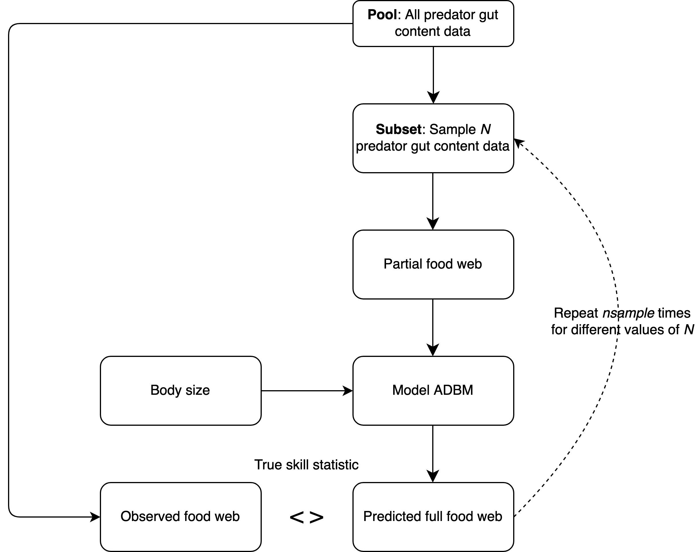
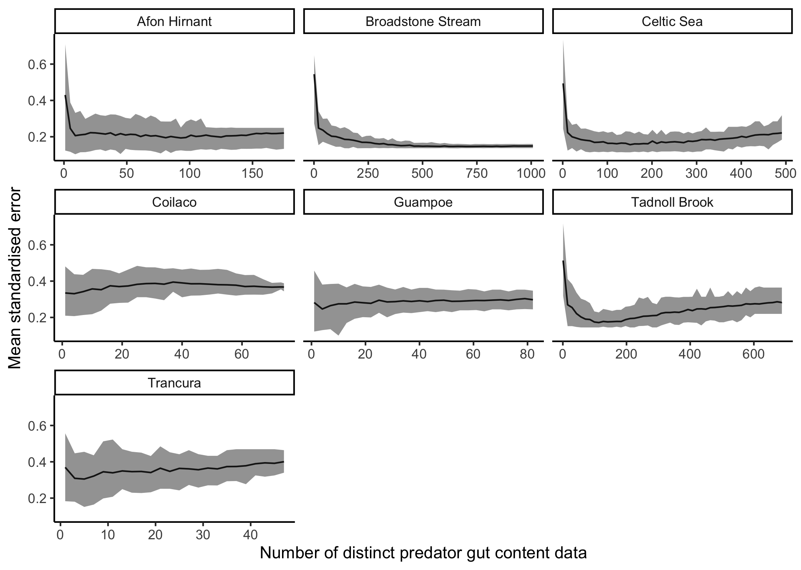

# Introduction

Knowledge about the trophic interactions in a food web is crucial in ecology for purposes ranging from identifying keystone species [@jordanKeystoneSpeciesFood2009] to quantifying robustness of a food web to species extinctions [@dunneNetworkStructureBiodiversity2002]. This has led to the development of numerous food web models [@allesinaGeneralModelFood2008; @cohenStochasticTheoryCommunity1985; @gravelInferringFoodWeb2013; @petcheySizeForagingFood2008; @tamaddoni-nezhadConstructionValidationFood2013]. Along with inferring missing links in an observed food web, the food web models are also used for ecological forecasting [@hattabForecastingFinescaleChanges2016; @lindegrenEcologicalForecastingClimate2010] and for understanding the underlying mechanism governing the interactions in a food web [@ogormanSimpleModelPredicts2019].

Although food web models are constructed using prior theory about the factors that determine trophic interactions, empirical data about interactions is required to parameterise a model. For example, @petcheySizeForagingFood2008 used presence-absence information about trophic interactions to parameterise the allometric diet breadth model and thereby predict species interactions. These empirical information about interactions can come from diverse set of methods such as gut content analysis [@peralta-maraverStructureDynamicsStability2017], stable isotope ratio analysis of tissues [@laymanCanStableIsotope2007], experimentation [@warrenSpatialTemporalVariation1989], DNA metabarcoding of gut contents or faeces [@roslinUseDNABarcodes2016] and literature research [@grayJoiningDotsAutomated2015; @cohenSoilInvertebratesChemistry2014; @goldwasserConstructionAnalysisLarge1993a].

<!-- **OP: The following three sentences may not be necessary here, or could perhaps go elsewhere.** All of these methods can provide information useful to infer the diet of a consumer, however different methods can result in different levels of uncertainty in the inferred diet (citreqd). A single gut content of a predator describes what that individual has consumed recently which can be used to infer the diet of the predator [@eitzingerTestingValidityFunctional2018; @omalleyEffectsFoodWeb2017; @dixonAssessingDietNorth2017; @mcclain-countsTrophicStructureMesopelagic2017b; @peralta-maraverStructureDynamicsStability2017]. Stable isotope data when combined with mixing models can be used to determine which prey items are most likely fed upon by a predator [@kadoyaIsoWebBayesianIsotope2012; @crawfordApplicationsStableIsotope2008]. -->

Each of these sources of information about trophic interactions has shortcomings. For example: Stable isotope ratio analysis of the organism's tissue does not give direct information of the diet of that organism but rather gives approximate trophic position of that species in the food web [@wadaUseStableIsotopes1991; @jenningsTrophicLevelsMarine2015]. Although mixing models can be used to determine what prey items are most likely fed upon by a predator, this results in uncertainty in the estimates [@kadoyaIsoWebBayesianIsotope2012; @crawfordApplicationsStableIsotope2008]. Similarly, DNA metabarcoding could have issues in detecting secondary predation or cannibalism [@pompanonWhoEatingWhat2012; @nielsen2018] and is prone to environmental contamination (e.g. DNA in the water swallowed along with DNA from an aquatic consumer's prey cannot be differentiated from actual prey) [@kellyUsingEnvironmentalDNA2014]. Furthermore, construction of food webs via literature review can lead to false positives--links included when in reality no link would occur because it makes an assumption that the species interactions inferred from a system will occur in another system as well[@grayJoiningDotsAutomated2015; @cohen2014; @goldwasser1993].

 @nielsen2018 have shown that gut content analysis method has a better match with real diet when compared to other methods.

Acquiring food web data from gut content analysis is time consuming and expensive (AG: Do we need a reference? Next sentence explains the reason.). In part this is due to the perception that many gut contents must be collected and analysed in order to be confident that the majority of possible trophic links among species have been observed. Furthermore, considerable time, resource investment, and expertise is required to process the collected samples. Hence, there is of considerable importance to know the minimum number of gut contents and of which consumer species that are required to parameterise a food web model with high accuracy and high precision, so that one knows when is a good time to stop collecting any further empirical data on the food web.

Therefore, the key question we are interested in answering is how much presence-absence information, in the form of gut content data, is required to infer food web structure from a food web model with high accuracy and high precision. In other words, how many samples of gut content should one collect from the field to parameterise a food web model? To answer this question, we use the presence-absence information from gut content data to parameterise the allometric diet breadth model (ADBM) thereby predicting trophic interactions in seven different food webs using rejection approximate Bayesian computation, where the fit of the model was measured using true skill statistics. We computed the true skill statistics of the predicted food webs for different number of predator guts to calculate the minimum number of gut content data to infer food web structure. Our study provides a guideline on how many gut content data is required to predict food web structure using a food web model.

# Materials and Methods

In the upcoming sections, we present the empirical food webs, the allometric diet breadth model (ADBM), and the gut content data used to infer the trophic interactions. We also give a detailed account of using partial gut content data to parameterise the ADBM using rejection approximate Bayesian computation (ABC). We assessed model predictions using the true skill statistic for comparison across food webs.

## The Empirical Food Webs

In our study, we used food webs for which gut content data is available at an individual level and data that is or that we could make FAIR [@wilkinsonFAIRGuidingPrinciples2016]. Presence and absence interactions of food web data can be aggregated in different ways [@gilljamSeeingDouble2011]. A common way of aggregating food web data is the taxonomic approach, in which nodes in the food web are taxa (e.g. species), or life stages of taxa, and one species is said to feed on another species if at least one individual of the latter is found in at least one gut of the former. Another approach is based on size, rather than taxonomy, and in this the nodes in the food web are size classes. Here, a feeding link occurs between two size classes if at least one prey item within a size class was found in the gut of another size class, irrespective of their taxonomy.

In our study, we aggregate the gut content data on the basis of size class because the food webs constructed using this approach were better predicted by the ADBM compared to the taxonomic approach [@woodward2010], and this is because the ADBM is based on foraging rules defined using the body sizes of organisms [@petcheySizeForagingFood2008].

Our study is based on the assumption that the food web constructed using the complete gut content data is the true food web. However, this might not be the case because the links are still under-sampled for many nodes [@woodwardIndividualBasedFoodWebs2010]. This could result in a lower true skill statistic (TSS) of the predicted food web from the ADBM, which can result in a biased estimate of the minimum number of gut content data required to achieve 95% of the TSS achieved using complete gut content data.

In the following sections 2.1.1-2.1.5, we briefly explain seven empirical food webs used in our study. The text used in those sections are paraphrased from @gilljamSeeingDouble2011.

<!-- ```{r echo=FALSE, warning=FALSE} -->

<!-- library(readxl) -->

<!-- library(knitr) -->

<!-- library(kableExtra) -->

<!-- fw_table <- read_excel("../table/fw_table.xlsx") -->

<!-- kable(fw_table, format = "latex", -->

<!--       caption = "\\label{fig:tab_1}Information about the empirical food webs. AG: Working on this.", escape = FALSE, align = "l") %>% -->

<!--   kable_styling(font_size = 7, latex_options="scale_down", row_label_position = 1) %>% -->

<!--   landscape(margin = "1cm") %>% -->

<!--   column_spec(1, width = "3cm") %>% -->

<!--   column_spec(2, width = "8em") %>% -->

<!--   column_spec(7, width = "8em") %>% -->

<!--   column_spec(8, width = "8em") %>% -->

<!--   column_spec(9, width = "8em") -->

<!-- ``` -->

### Broadstone Stream

Broadstone Stream (51$^\circ$ 05' N 0$^\circ$ 03' E; 120 m above sea-level) is a second-order tributary of the River Medway in south-east England. At the time of sampling in 1996--1997, the stream was acidic (pH 4.7--6.6) and fishless. About 31 common species make up the macroinvertebrate food web, including six major predators and detritivores like stoneflies and chironomids [@woodwardQuantificationResolutionComplex2005].

Between June 1996 and April 1997, thirty randomly scattered benthic Surber sample-units (25cm $\times$ 25cm quadrat; mesh aperture 330mm) were taken every two months and kept in 5% formalin. All individuals retrieved from the benthos and identified in stomach contents had their linear body dimensions quantified and converted to dry mass using known regression formulae (listed in @woodwardBodysizeDeterminantsNiche2002).

The predators' foreguts were dissected and analysed with 400 magnification in the Surber samples. The individual body masses of eaten prey were calculated using the same methods as for the benthic samples, using reference slides as a guide [@woodwardQuantificationResolutionComplex2005]. Over the six sample instances, a single dataset was produced. Each predator and prey individual involved in a feeding relationship was measured and converted into their respective body masses, resulting in a total of 2893 individuals.

### Celtic Sea

The Celtic Sea is a continental shelf area that is bounded by Ireland, the United Kingdom, and the Bay of Biscay. Because the @barnesPredatorPreyBody2008 dataset, from which the data utilised in this chapter were taken, did not provide precise sampling sites and dates, the data was pooled throughout the whole time period and locations to capture broad tendencies. Only places that were sampled consistently from 1987 to 2001 were used [@blanchardClimateFishingInfluence2005].

In a published global dataset of individual predator and prey body sizes and taxonomy (Barnes et al., 2008), the feeding linkages of fish in the Celtic Sea were described. The original stomach contents data were acquired during annual surveys conducted by the Centre for Environment, Fisheries, and Aquaculture Science (Cefas) on board research vessels during dissections [@pinnegarDoesDietCeltic2003]. @barnesPredatorPreyBody2008 used known regression equations to measure predator and prey lengths and convert them to body mass.

### Afon Hirnant

Three sites in the Afon Hirnant, in North Wales, UK ($52^\circ$ 52' N $03^\circ$ 34' W), were used for the study. The average yearly discharge was 2.08 to 7.26 $m^3/s$, with a pH ranging from 5.5 to 7. (check @figueroaFoodWebDynamics2007 and @woodwardChapterIndividualBasedFood2010 for full details). Invertebrates were collected using a Hess sampler (sampling area: 0.028 $m^2$; mesh aperture 80 $\mu m$), with 15 sample-units obtained at random at each site and season, totaling 180 samples across the sampling period. The invertebrate fauna was promptly preserved in 100% ethanol and sorted in the lab. By removing predators' foreguts, which were mounted in Euparal media and viewed at 400 magnification, feeding interactions were determined.

Every predator's linear dimensions (for example, body length) and individual prey items inside each predator's foregut were measured and then translated to body mass values using published regression equations for each taxon (presented in @woodwardChapterIndividualBasedFood2010). If the prey items were highly digested, the average body length of individuals in the same family (Ephemeroptera, Plecoptera, or Trichoptera) in the habitat was used. The body lengths of Chironomidae (Diptera) were calculated using previously established species-specific regressions between head capsule width and body length [@figueroaFoodWebDynamics2007].

### Tadnoll Brook

The Tadnoll Brook is a tributary of the River Frome in Southern England, UK, with a mean annual discharge of 0.35 $m^3/s$ and a pH of 6.9--7.7. (Edwards et al., 2009b).

A 240-m reach was sampled every two months between February and December 2005 to create the summary food web. A Surber sampler was used to collect invertebrates every two months (0.06 m2; mesh aperture 300 mm). 20 random samples were taken on each occasion, stored in the field in 4% (w/v) formalin, and then sorted for invertebrates. Fish were captured with an electrofisher, anaesthetized with 2-phenoxyethanol, recognised to species, measured, and weighed on each occasion (Woodward et al., 2010). The guts of trout (Salmo trutta L.) with fork lengths more than 70 mm were then flushed with a tiny manual water pump and stored in 4% formalin. For smaller trout and other fish species (*Cottus gobio*, *Anguilla anguilla*, *Phoxinus phoxinus*, *Barbatula barbatula*, *Gasterosteus aculeatus*), specimens were sacrificed and frozen for subsequent dissection.

Gut contents analysis was performed on each sample occasion for the fish assemblage, whereas invertebrates had far less varied diets and were only characterised in May and October. Individuals of the benthos' numerically dominant or trophically important invertebrate taxa were taken from the Surber samples, dissected, and the contents of the foregut investigated for animal prey, which were recognised at $400\times$ magnification by comparison with reference specimens. The taxa used to examine stomach contents covered more than 95% of the individuals observed in the Benthos. Wherever possible, predators' gut contents were matched to species, and linear body dimensions were measured. Using established regression equations, the dry mass of prey items and invertebrate predators was calculated [@benkeLengthMassRelationshipsFreshwater1999; @ganiharBiomassEstimatesTerrestrial1997; @burgherrRegressionAnalysisLinear1997; @gonzalezSizemassRelationshipsStream; @smockRelationshipsBodySize1980; @edwardsRelationshipLengthMass2009; @meyerRelationshipBodyLength1989].

### Guampoe, Coilaco and Trancura Rivers, Chile

Three rivers (the Coilaco, Guampoe, and Trancura Rivers) in the catchment area of the Tolten River in south Chile, South America, were studied in a similar way. The Coilaco River (discharge 2.1--16.8 $m^3/s$), Guampoe River (output 1.8--7.5 $m^3/s$), and Trancura River (discharge 8.8--49.3 $m^3/s$) are all pH 6.7--7.6 circumneutral rivers [@figueroaFoodWebDynamics2007].

In each river, eight benthic samples were taken in each season between 1984 and 1985, totaling 96 sample-units for the whole sampling period (Campos et al., 1985). Invertebrates were gathered using a Surber sampler (sampling area: 0.09 $m^2$; mesh aperture 250 $\mu m$) and stored in 70% ethanol before being transported to the lab for species identification and food web analysis.

The feeding linkages were discovered by analysing the gut contents of all individuals observed in each sample. Large invertebrates had their guts removed and mounted in Euparal, whilst small specimens were mounted whole and studied with $400\times$ magnification. Following Schmid (1993) and [@schmid-arayaConnectanceStreamFood2002], species prey items detected on each gut were identified using previously mounted reference slides. Using known regression equations (mentioned in @reissExistingPlentyAbundance2008; @baumgartnerPredictiveLengthDry2003; @miserendinoRelacionesLongitudpesoPara2001; @woodwardIndividualBasedFoodWebs2010), all linear dimensions were translated to body mass estimates.

## Allometric Diet Breadth Model (ADBM)

The allometric diet breadth model (ADBM) is based on optimal foraging theory, specifically the contingency foraging model [@macarthurOptimalUsePatchy1966]. We chose this model for various reasons, including because it uses the body size of organisms as input to predict feeding interactions, and because of our familiarity with it. The ADBM predicts the set of prey types (e.g. species or sizes classes) a consumer should feed upon to maximise its rate of energy intake [@petcheySizeForagingFood2008]. The foraging variables in the model are: energy content of the resources, handling times of the prey, space clearance rate, and prey densities. These are allometrically scaled to the body sizes of the species. Further details on the foraging rules defined in the ADBM and ADBM's predictive power across different food webs can be found in @petcheySizeForagingFood2008.

## Assessment of prediction

The accuracy of the predicted diet of the predators was measured using true skill statistic (TSS) which takes into account the true and false predictions of both the presence and absence of links defined as:

$$ \text{TSS} = \frac{ad-bc}{(a+c)(b+d)} $$ where $a$ is the number of observed links that are predicted by the model (true positives), $d$ is the number of observed absences of links that are correctly predicted (true negatives), $b$ is the number of false positives, and $c$ is the number of false negatives. The $TSS$ ranges from $-1$ to $1$, where +1 indicates a perfect prediction. A $TSS$ value of zero or less indicates a performance no better than random [@alloucheAssessingAccuracySpecies2006].

## Inferring food web using partial gut content data

**Comment AG: Is it necessary to have the sections 1.1 and 1.2 of the supplementary information in the Supplementary information or shall the sections 1.1 and 1.2 be migrated to the main text (manuscript)?**

From an empirical dataset of gut content data, we take a random sample of gut contents of specific size (see below) to create a partial gut content dataset. We then fit the ADBM to this partial dataset.


```{r, echo=FALSE, fig.align='center', out.width="500px", fig.cap="\\label{fig:fig_ra} (a, c, e, g, i, k, m) Accuracy of the predicted food web measured using the true skill statistics, predicted by the ADBM parameterised using gut content data. Line and shaded grey region represents the mean and the prediction interval of 100 independent samples respectively. Red line represents the number of predator guts required to achieve a TSS of 95\\% of the maximum TSS. (b, d, f, h, j, l, n) Ratio of the true skill statistic of the predicted food web by the ADBM parameterised using gut content data to that of the predicted food web constructed using gut content data only. The dashed line shows where the ratio is one for reference."}

```


To fit the ADBM to a gut content dataset (be it complete or partial), we used the rejection ABC method we previously developed in @guptaSimultaneouslyEstimatingFood2022 to accept a parameter value from a prior distribution which would have resulted in the minimum distance, where distance = 1 - True skill statistic. The true skill statistic was computed between the diets predicted from the ADBM, and those observed in the sampled gut content data. We repeated this process $n~(= 100)$ times for every $i$ number of guts, where $i$ lies between 1 and total number of gut content data in the pool.

*Input:*

-   Predators $P: P = \{p_1, p_2, \dots, p_k \}$

-   A pool of gut content data $G: G = \{g_1, g_2, \dots, g_n\}$, where $g_{n}$ is the observed diet matrix containing ones and zeros.

-   A model prediction $model(\theta): ADBM(\theta) = \{d_{p_1}, d_{p_1}, \dots, d_{p_k}\}$, where $d_{p_k}$ is the predicted diet matrix of predator $k$ containing ones and zeros.

-   A summary statistic $s(x): s(x) \subseteq model(\theta)$, where $s(x)$ is the diet of some or all of the predators.

-   A distance function $d(x_i, y) : d(x_i,y) = 1 - TSS(x_i, y)$, which quantifies how close the observed diet is to the predicted diet of some or all of the predators.

-   An observed food web $Y: Y = \{d_{p_1}', d_{p_1}', \dots, d_{p_k}'\}$, where $d_{p_k}'$ is the observed diet matrix of predator $k$ containing ones and zeros.

*Sampling:*

for $i = 1, \dots, tgut$ where $tgut$ is the total number of gut content data in the pool $G$

-   for $j = 1, \dots, nsample$ where $nsample$ is the number of independent samples to be drawn

    -   Draw a set of gut content data $y = \{g_1, g_2, \dots, g_i\}$ from the pool of gut content data $G$

    -   for $k = 1, \dots, npar$ where $npar$ is the number of parameter values to be sampled

        -   Draw a set of parameter values $\theta_k$ from the prior distribution $\pi(\theta)$

        -   Compute the model result $x_i = model(\theta_k)$

        -   Compute $s(x_i)$ and $d(s(x_i), y)$

    -   Accept $\theta_j$, which results in the $min_i\{d(s(x_i), y)\}$

-   Compute $TSS_{i}(x, y) = \{TSS(x_i,y): x_i = ADBM(\theta_j), \theta_j \text{ computed from previous step}\}$ using the accepted $\theta_1, \dots, \theta_{nsample}$

*Output:*

The $TSS$ between observed and predicted food webs, and the posterior parameter distributions for every $i$ number of gut content data drawn from the pool of gut content data.

## Computing the minimum gut content data

Using TSS of the predicted food webs for different number of predator guts, we computed the number of gut content data that results in the mean TSS equal to the 95% of the mean TSS achieved by the model using all the predator guts for a food web. We call this number of gut content data as the minimum gut content data.

# Results

We first present how the accuracy of the food web model in predicting trophic interactions varies with increasing amount of gut content data provided to the food web model. Then, we calculate the number of gut content data for each food webs that results in accuracy equal to 95% of the maximum true skill statistics predicted by the food web model.

## Inferring trophic interactions using ADBM and incomplete gut content data

```{r, echo=FALSE, fig.align='center', out.width="500px", fig.cap="\\label{fig:fig_ra} (a, c, e, g, i, k, m) Accuracy of the predicted food web measured using the true skill statistics, predicted by the ADBM parameterised using gut content data. Line and shaded grey region represents the mean and the prediction interval of 100 independent samples respectively. Red line represents the number of predator guts required to achieve a TSS of 95\\% of the maximum TSS. (b, d, f, h, j, l, n) Ratio of the true skill statistic of the predicted food web by the ADBM parameterised using gut content data to that of the predicted food web constructed using gut content data only. The dashed line shows where the ratio is one for reference."}
knitr::include_graphics("../../results/misc/plot_TSS_ratio.png")
```

The true skill statistics of the food webs predicted by the ADBM using subsets of gut content data improved quickly for lower number of predator guts (Fig. \ref{fig:fig_ra}) (a, c, e, g, i, k, m). Furthermore, the width of the prediction interval of the true skill statistics decreased with increasing number of predator guts with the mean TSS asymptoting to the maximum mean TSS achieved by the ADBM when all the gut content data was used. Although the maximum TSS varied among the food webs, the qualitative increase in the TSS was the same.

For Broadstone Stream food web, with only 381 gut contents, which is 38% of the total gut content data, the ADBM predicted the food web with the mean TSS of 0.74 which was 95% of the mean TSS (0.78) achieved using complete gut content data (Fig. \ref{fig:fig_ra}(a)). In case of the Celtic Sea food web, only 171 gut content data which is 35% of the total gut content data was required by the ADBM to predict food web with TSS equal to 95% of the mean TSS (0.68) achieved using complete gut content data (Fig. \ref{fig:fig_ra}(c)).

For a low number of predator guts, the TSS of the model predicted food web was higher than the TSS of the food web constructed from gut content data only (Fig. \ref{fig:fig_ra} (b, d, f, h, j, l, n)). An increase in the number of predator guts did reduce the ratio TSS(Model)/TSS(data) reduced to less than one, and reduced further gradually. This shows that with less data available it is better to use the model, while if more data is available then it is better to use the data itself.

<!-- ## Mean standardised error in structural properties with respect to the number of gut content data -->

<!-- Mean standardised error in structural properties of Afon Hirnant, Broadstone Stream, Celtic Sea and Tadnoll Brook food web reduced drastically with increasing number of predator gut content data at low number of predator gut content data (Fig. \ref{fig:fig_rab}). In case of Broadstone Stream food web, the 95% prediction interval reduced as well with increasing number of predator gut content data.  -->

<!-- \*\*AG: Working on this paragraph. -->

<!-- ```{r, echo=FALSE, fig.align='center', out.width="500px", fig.cap="\\label{fig:fig_rab} Mean standardised error in structural properties of different food webs with respect to the number of gut content data."} -->

<!--  -->

<!-- ``` -->

## Dependence of the minimum gut content data on number of links and connectance

There was a significant positive relationship between the minimum number of gut content data (i.e the amount of gut content data used in order to ensure 95% of the maximum TSS) and the connectance of the food webs (Fig. \ref{fig:fig_rb} (a)). Similarly, we also observed a positive relationship between the minimum number of gut content data and the number of trophic links (L) in the food webs, however this relationship was not significant (Fig. \ref{fig:fig_rb} (b)). Furthermore, there was a significant positive relationship between the number of minimum gut content data and the the number of maximum gut content data sampled (Fig. \ref{fig:fig_rb} (c)) for food webs.

```{r echo=FALSE, fig.align='center', out.width="400px", fig.cap="\\label{fig:fig_rb} (a, b, c) Number of minimum gut content data (i.e the amount of gut content data used in order to ensure 95\\% of the maximum TSS) plotted against number of links (L), connectance (C) and number of maximum guts sampled respectively. Solid lines are linear regression ((a) t = 3.138, df = 5, P = 0.0257; (b) t = 0.876, df = 5, P = 0.421; (c) t = 9.571, df = 5, P = 0.0002) and grey region represents 95\\% confidence intervals."}
knitr::include_graphics("../../results/misc/plot_min_gut_vs_X.png")
```

# Discussion

We have demonstrated how a food web model can be used to predict food webs reasonably well even when incomplete data about trophic interactions is available. At lower amount of gut content data, predicting with the model is better than using the data itself, while at higher amounts of gut content data, it is better to only use the data. This can help inform how much gut content data to actually collect when we are using a food web model to infer trophic interactions. A future development could be to make the same assessment using other food web models, and to also use food web data other than gut content data to parameterise those models.

## Why incomplete gut content data can be used to infer trophic interactions?

In all of the seven food webs, the ADBM was able to infer the trophic interactions using incomplete gut content data because the presence absence information from the gut content data was still sufficient to constrain the possible model parameter values of the ADBM that best explained the predators' diets. Although in theory the ADBM can predict trophic interactions using only body sizes of organisms as it is based on set of foraging rule, it still requires some presence absence data to constrain the posterior parameter space thereby making more accurate predictions.

## Why does the minimum gut data differ among food webs?

We found the minimum amount of gut content data to vary across food webs and this could be due to the possibility that the food webs are sampled differently, i.e. some food webs are more extensively sampled than others (SI Fig. S2). Furthermore, it is possible that interactions in some of the food webs are are more size-structured than others, and are therefore better predicted by the ADBM and consequently require a lower number of gut content data for model parameterisation.

## Model fills up missing interactions and guides sampling direction

When little data about trophic interactions is available, the model can be used to add data about interactions for which data is missing. Furthermore, the model predictions can be used as a guide to sample those predator guts for which we do not have enough information on the presence of interactions from the empirical gut content samples but the model suggests there are interactions. Therefore, with enough number of predator guts sampled one might possibly observe those missed interactions.

<!-- [OP: how? I suggest to explain this in more detail.] -->

## Why is model's TSS less than one?

The food web model used (the ADBM) cannot explain all the interactions in any observed food web that it has been fit to. The foraging rules it encodes are based on the body size and have particular structure and assumptions; not all of these are met by all observed interactions. For example, the ADBM can only predict diets that are contiguous with respect to the size of prey. I.e. it cannot predict that a predator will consume taxa of size 1 and 3, and not taxa of size 2. Hence, if the observed diets are not contiguous when prey are ordered by their size, the estimation process could lead to a lower value of the TSS.

Furthermore, the observed data may be missing links, e.g. links that rarely occur. Hence the ADBM's maximum predicted true skill statistics is less than one for all food webs it has so far been fit to.

## TSS(Model)/TSS(Data) for different food webs

In all the food webs, the ratio TSS(Model)/TSS(Data) decreased with increasing number of predator guts (Fig. \ref{fig:fig_ra} (b, d, f, h, j, l, n)). This suggests when less data is available it is better to use the model and when more data is available it is better to only use the data to predict trophic interactions. At lower number of predator guts the model fills up the missing interactions that were not observed in the gut content data, therefore resulting in model performing better as compared to data alone. Wile at higher number of predator guts the model is probably predicting some presence or absence of links i.e. false positives and false negatives resulting in a lower TSS as compared to that of data alone.

<!-- ## Why Broadstone Stream is an outlier? -->

<!-- In most of the plots, Broadstone Stream food web was an outlier (Fig. \ref{fig:fig_rc})). This can be attributed to the fact that the Broadstone Stream food web was the most sampled food web (Fig. SI XXX). Since the Broadstone Stream food web has the highest number of predator gut content data as compared to other food webs so the chances of missing links is lower in the Broadstone Stream food web as compared to others.  -->

<!-- \*\*AG: Working on this, not sure if this paragraph is needed. -->

## Propagating uncertainty from gut content data to model's predictions

<!-- \*\*OP Focus on this, at least in the context of further work that could be done. ## There is uncertainty in gut content data and needs to be propagated into model's predictions -->

There is considerable uncertainty involved in gut content analysis [@bakerFishGutContent2014] such as in fish's guts, there are sometimes loose tissues that are not identifiable and cannot be assigned to a specific prey item with certainty. There are factors such as sample size of consumers, mechanical prey handling, differential digestion and evacuation rates of different prey types and volumes, and the ingestion order that in combination result in an unquantifiable error which is difficult to interpret in the predator diet [@hyslopStomachContentsAnalysis1980; @rindorfBiasEstimatingFood2004; @bakerFishGutContent2014]. Therefore, a future development would be to consider how this uncertainty is propagated into food web prediction.

## Comparing our study with other studies of predicting food webs using incomplete data

<!-- [OP: This one I already shared with you: https://onlinelibrary.wiley.com/doi/10.1111/ele.13966 -->

<!-- \*\*OP: Focus on this, and other studies that have looked at the importance of quantity and quality of food web data ## Comparing our study with other studies of predicting food webs using incomplete data -->

Some studies have presented how the accuracy of food web prediction change when we vary the amount of food web data [@grayJoiningDotsAutomated2015]. For example: @desjardins-proulxEcologicalInteractionsNetflix2017 has used predictive machine learning models and @caronAddressingEltonianShortfall has used predictive traits-based models on partial knowledge of interactions to reconstruct a food web accurately, in contrast to our study where we used a mechanistic food web model.

<!-- \*\*AG: Working on this paragraph. -->

## What is the generalisability of our results?

<!-- \*\*OP: Focus on this. -->

In our study, we have implemented the approach only with the ADBM. However, in principle, this approach could be extended to other food web models such as [@williamsSimpleRulesYield2000; @gravelInferringFoodWeb2013; @allesinaGeneralModelFood2008]. A future prospect could be to study how well different food web models' prediction accuracy vary with different amount of gut content data. This can also help in making decision as to which food web model to chose from for a given a set of gut content data. We suspect the relationship (i.e shape of the curve) between the TSS of the predicted food web and the number of predator guts might vary within food web models.

<!-- [OP: comment if and why one might expect other food web models to show different efficiency.] -->

## Assumption that the food web constructed with the total gut content data is the true food web and how can this be improved

<!-- [OP: this paragraph / section needs further development] -->

Some of the food webs are not very well predicted using the ADBM. And this could possibly result in a lower value of minimum gut content data that was used to achieve 95% of the maximum TSS. This could be because our study is based on the assumption that the true food webs is the one which was constructed using the total gut content data. However, if the total gut content does not contain sufficient information to construct the complete food web, then the food web will miss some links. This would therefore result in a lower TSS of the predicted food web, which can eventually lead to a lower estimate of the minimum gut content data. A future prospect could be to incorporate other sources of presence-absence data such as stable isotope ratio, metabarcoding to complement any links that were missed by the gut content method.

## How can we include other types of food web data?

A future prospect would be to include other types of food web data along with gut content simultaneously to parameterise the ADBM. For example, one could use the approximate trophic position inferred from stable isotope ratio data from a tissue of an individual and gut content data of a different predator simultaneously to parameterise a food web model such as the ADBM. In this case, trophic position would be an additional summary statistic required in the parameterisation method. This combination of different types of data about trophic interactions could be particularly useful when only a limited amount of diet information can be extracted by using a single method.

# Acknowledgements

# Author contributions

# Reference
