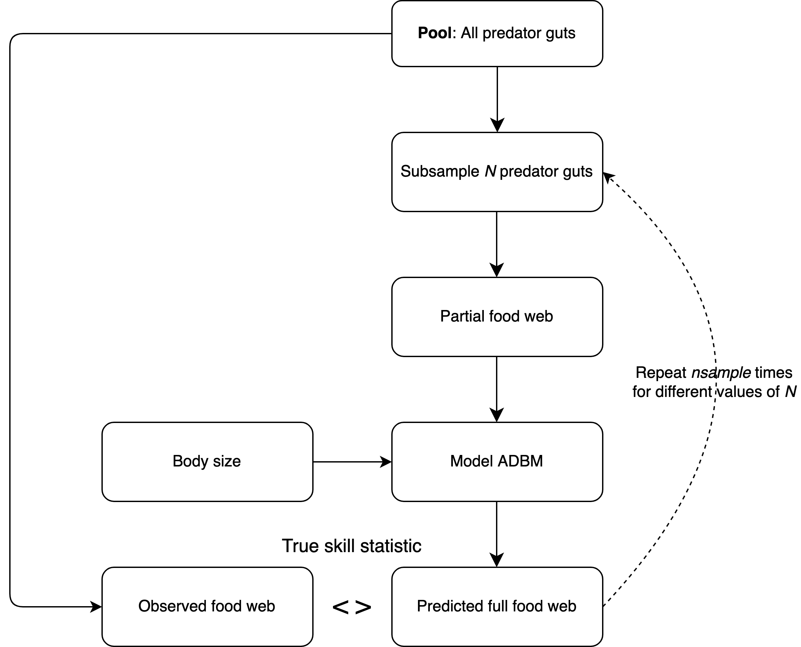
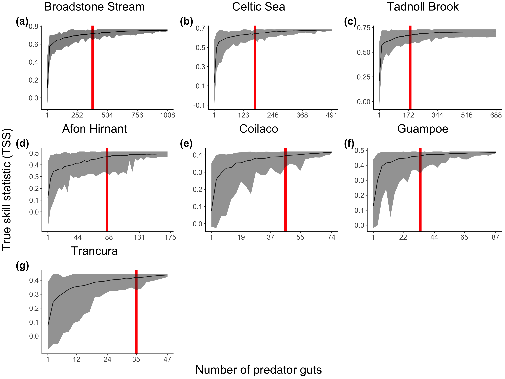
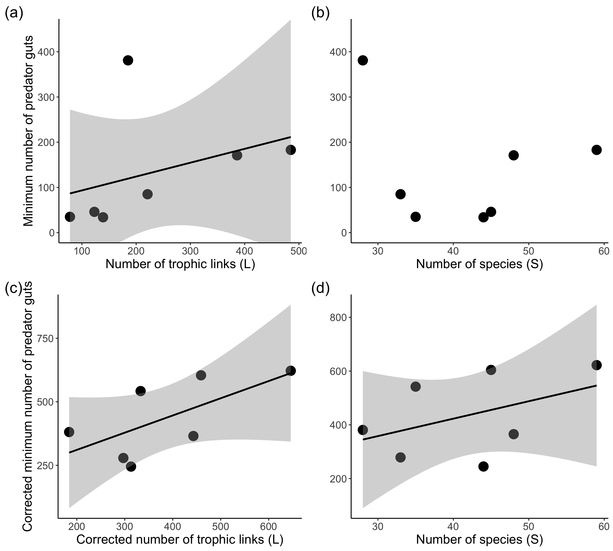

# Introduction

Knowledge about the trophic interactions in a food web is crucial in ecology for purposes ranging from identifying keystone species [@jordanKeystoneSpeciesFood2009] to quantifying robustness of a food web to species extinctions [@dunneNetworkStructureBiodiversity2002]. This has led to the development of numerous food web models and associated theory [@allesinaGeneralModelFood2008; @cohenStochasticTheoryCommunity1985; @gravelInferringFoodWeb2013; @petcheySizeForagingFood2008; @tamaddoni-nezhadConstructionValidationFood2013]. Along with inferring missing links in an observed food web, such food web models are also increasingly used for ecological forecasting [@hattabForecastingFinescaleChanges2016; @lindegrenEcologicalForecastingClimate2010] and for understanding the underlying mechanism governing trophic interactions in the wild [@ogormanSimpleModelPredicts2019].

Although food web models are constructed using prior theory about the factors that determine trophic interactions, empirical data about interactions are required to parameterise a model. For example, @petcheySizeForagingFood2008 and @guptaSimultaneouslyEstimatingFood2022 used presence-absence information about trophic interactions to parameterise the allometric diet breadth model and thereby predict species interactions. Such empirical information about interactions can come from diverse set of methods such as gut content analysis [@peralta-maraverStructureDynamicsStability2017], stable isotope ratio analysis of tissues [@laymanCanStableIsotope2007], experimentation [@warrenSpatialTemporalVariation1989], DNA metabarcoding of gut contents or faeces [@roslinUseDNABarcodes2016] and literature research [@grayJoiningDotsAutomated2015; @cohenSoilInvertebratesChemistry2014; @goldwasserConstructionAnalysisLarge1993a] but each of these sources of information about trophic interactions has serious shortcomings, hindering the advancement of the field. For example: stable isotope ratio analysis of the organism's tissue does not give direct taxonomically resolved information of the diet of that organism, but rather it provides approximate trophic position of that species in the food web [@wadaUseStableIsotopes1991; @jenningsTrophicLevelsMarine2015] and although mixing models can be used to determine what prey items are most likely fed upon by a predator, this results in uncertainty in the estimates [@kadoyaIsoWebBayesianIsotope2012; @crawfordApplicationsStableIsotope2008]. Similarly, more recent approaches using DNA metabarcoding may give much higher taxonomic resolution but present other challenges, such as an inability to resolve secondary predation or cannibalism [@pompanonWhoEatingWhat2012; @nielsen2018] which are common in nature and also being prone to environmental contamination (e.g. DNA in the water swallowed along with DNA from an aquatic consumer's prey cannot be differentiated from actual prey) [@kellyUsingEnvironmentalDNA2014]. Furthermore, construction of food webs via literature review, which is one of the most common practices in food web research, can lead to false positives--links included when in reality no link would occur because it makes an assumption that the species interactions inferred from a system will occur in another system as well [@grayJoiningDotsAutomated2015; @cohen2014; @goldwasser1993]. It is unsurpsing given the limitations of these proxy or inferential approaches that authors such as @nielsen2018 have shown that gut content analysis method has a better match with real diet when compared to other methods.

Although gut content analysis is viewed as the "gold standard", acquiring such food web data from direct gut content analysis is extremely time consuming and expensive [@grayJoiningDotsAutomated2015a] and it also requires high skill levels in taxonomic identification, often involving dissection and microscopy techniques [@hyslopStomachContentsAnalysis1980]. The perception that this is unavoidably laborious and costly is also in part due to the assumption that many gut contents must be collected and analysed in order to be confident that the majority of possible trophic links among species have been observed. Most studies fail to quantify the effort needed, with yield-effort curves being the exception rather than the rule and those that have been done often point to the apparent need for hundreds or thousands of guts to be analysed to fully capture a food web's structure. Hence, it is of huge importance to know the minimum number of predator guts required to parameterise a food web model with high accuracy and high precision: this would enable researchers to allocate resources more effectively a priori, and even having a rough rule of thumb as to when is a good point to stop collecting any further empirical data on the food web is far better than the current common practice of simply taking a fixed set of samples with on yield-effort analyses being undertaken.

Therefore, the key question we are interested in answering is how much presence-absence information, in the form of predator guts, is required to infer food web structure from a food web model with high accuracy and high precision? In other words, how many samples of predator guts should one collect from the field to parameterise a food web model? To answer this question, we use different amount of predator guts to parameterise the allometric diet breadth model (ADBM) thereby predicting trophic interactions in seven different food webs using rejection approximate Bayesian computation, and calculate the minimum number of predator guts to infer food web structure. Our study provides a guideline on how many predator guts are required to predict food web structure using a food web model.

# Materials and Methods

We present the empirical food webs, the allometric diet breadth model (ADBM), and the predator guts used to infer the trophic interactions. We also give a detailed account of using partial predator guts to parameterise the ADBM using rejection approximate Bayesian computation (ABC). We assessed model predictions using the true skill statistic for comparison across the food webs.

## The Empirical Food Webs

In our study, we used food webs for which predator guts are available at an individual level and data that is or that we could make FAIR (Findable Accessible Interoperable Reusable; @wilkinsonFAIRGuidingPrinciples2016). In our study, first, we consider food webs where nodes are size classes i.e. individuals are aggregated into these size classes based on their body size. A feeding link occurs between two size classes if at least one prey item within a size class was found in the gut of another size class of predator, irrespective of the taxonomy of the individuals. We used this approach because of several reasons such as to take account the ontogenetic shift in the diet of a predator [@woodward2010], individual-based interaction based on body size which would not been considered if nodes were aggregated based on taxonomy as a taxonomic node can have a large variation in the body size. Food webs aggregated using size can be used to model the impacts of commercial exploitation on marine ecosystems [@jenningsPredictingEffectsClimate2010]. Second, we also consider food webs where nodes are aggregated based on the taxonomy of the individuals as this is the most common way of constructing food webs in food web ecology.

Our study food webs are freshwater food webs except the Celtic Sea food web which belongs to a marine ecosystem. Most of the food webs are dominated by invertebrates except Celtic Sea which is dominated by fishes and Tadnoll Brook which is dominated by fishes as well as invertebrates. The food webs vary in the number of nodes, trophic links, connectance and body sizes (Table 1). 

Invertebrates in freshwater food webs were collected using Hess or Surber sampler, whereas fishes were caught with electrofisher, and anaesthetised using 2-phenoxyethanol in freshwater food webs. In case of the Celtic Sea, trawling was used to catch fishes. 

The foreguts of the collected invertebrate predators were dissected and examined under the microscope. Regression equations were used to convert predator and prey lengths to the respective body masses. In case if the prey items were too highly digested for body lengths to be measured reliably, previously established regressions based on head capsule width were used as an alternative linear dimension. More detailed description of these food webs is present in @gilljamSeeingDouble2011.

```{r echo=FALSE, warning=FALSE}

library(readxl)

library(knitr)

library(kableExtra)

fw_table <- read_excel("../table/fw_table.xlsx")

kable(fw_table, format = "latex",

      caption = "\\label{fig:tab_1}Information about the empirical food webs. AG: Some information will be updated.", escape = FALSE, align = "l") %>%

  kable_styling(font_size = 7, latex_options="scale_down", row_label_position = 1) %>%

  landscape(margin = "1cm") %>%

  column_spec(1, width = "3cm") %>%

  column_spec(2, width = "8em") %>%

  column_spec(7, width = "8em") %>%

  column_spec(8, width = "8em") %>%

  column_spec(9, width = "8em")

```

## Allometric Diet Breadth Model (ADBM)

The allometric diet breadth model (ADBM) is based on optimal foraging theory, specifically the contingency foraging model [@macarthurOptimalUsePatchy1966]. We chose this model because it can predict species interactions based on an easily measurable trait body size. The ADBM predicts the set of prey types (e.g. species or sizes classes) a consumer should feed upon to maximise its rate of energy intake [@petcheySizeForagingFood2008]. The foraging variables in the model are: energy content of the resources, handling times of the prey, space clearance rate, and prey densities. These are allometrically scaled to the body sizes of the species. Further details on the foraging rules defined in the ADBM and ADBM's predictive power across different food webs can be found in @petcheySizeForagingFood2008.

## Assessment of prediction

The accuracy of the predicted diet of the predators was measured using a widely used accuracy measure in food web ecology namely true skill statistic (TSS) [@grayJoiningDotsAutomated2015; @gravelInferringFoodWeb2013; @guptaSimultaneouslyEstimatingFood2022]. We chose this metric because it takes into account the true and false predictions of both the presence and absence of links defined as:

$$ \text{TSS} = \frac{ad-bc}{(a+c)(b+d)} $$ where $a$ is the number of observed links that are predicted by the model (true positives), $d$ is the number of observed absences of links that are correctly predicted (true negatives), $b$ is the number of false positives, and $c$ is the number of false negatives. The $TSS$ ranges from $-1$ to $1$, where +1 indicates a perfect prediction. A $TSS$ value of zero or less indicates a performance no better than random [@alloucheAssessingAccuracySpecies2006].

## Inferring food web using partial predator guts

From an empirical dataset of predator guts, we take a random sample of gut contents of specific size (see below) to create a partial predator guts dataset. We then fit the ADBM to this partial dataset.

```{r, echo=FALSE, fig.align='center', out.width="350px", fig.cap="\\label{fig:fig_ra} Flowchart of the subsampling method implemented to predict the full food web from the food web model using the predator guts."}

```

To fit the ADBM to partial predator guts dataset, we used the rejection approximate Bayesian computation method we previously developed in @guptaSimultaneouslyEstimatingFood2022 to accept a parameter value from a prior distribution which would have resulted in the minimum distance, where distance = 1 - TSS. The true skill statistic was computed between the diets predicted from the ADBM, and those observed in the sampled predator guts. We repeated this process $n~(= 100)$ times for every $i$ number of guts, where $i$ lies between 1 and total number of predator guts in the pool.

*Input:*

-   Predators $P: P = \{p_1, p_2, \dots, p_k \}$

-   A pool of predator guts $G: G = \{g_1, g_2, \dots, g_n\}$, where $g_{n}$ is the observed diet matrix containing ones and zeros.

-   A model prediction $model(\theta): ADBM(\theta) = \{d_{p_1}, d_{p_1}, \dots, d_{p_k}\}$, where $d_{p_k}$ is the predicted diet matrix of predator $k$ containing ones and zeros.

-   A summary statistic $s(x): s(x) \subseteq model(\theta)$, where $s(x)$ is the diet of some or all of the predators.

-   A distance function $d(x_i, y) : d(x_i,y) = 1 - TSS(x_i, y)$, which quantifies how close the observed diet is to the predicted diet of some or all of the predators.

-   An observed food web $Y: Y = \{d_{p_1}', d_{p_1}', \dots, d_{p_k}'\}$, where $d_{p_k}'$ is the observed diet matrix of predator $k$ containing ones and zeros.

*Sampling:*

for $i = 1, \dots, tgut$ where $tgut$ is the total number of predator guts in the pool $G$

-   for $j = 1, \dots, nsample$ where $nsample$ is the number of independent samples to be drawn

    -   Subsample a set of predator guts $y = \{g_1, g_2, \dots, g_i\}$ from the pool of predator guts $G$

    -   for $k = 1, \dots, npar$ where $npar$ is the number of parameter values to be sampled

        -   Draw a set of parameter values $\theta_k$ from the prior distribution $\pi(\theta)$

        -   Compute the model result $x_k = model(\theta_k)$

        -   Compute $s(x_k)$ and $d(s(x_k), y)$

    -   Accept $\theta_j$, which results in the $min_k\{d(s(x_k), y)\}$

-   Compute $TSS_{i}(x, Y) = \{TSS(x_i, Y): x_i = ADBM(\theta_j), \theta_j \text{ computed from previous step}\}$ using the accepted $\theta_1, \dots, \theta_{nsample}$

*Output:*

The $TSS$ between observed and predicted food webs, and the posterior parameter distributions for every $i$ number of predator guts drawn from the pool of predator guts.

## Computing the minimum number of predator guts

Using TSS of the model predicted food webs for different number of predator guts, we computed the number of predator guts that results in the mean TSS equal to the 95% of the mean TSS achieved by the model using all the predator guts available in the pool for a food web. We call this number of predator guts as the minimum number of predator guts.

## Standardising sampling level of the food webs

Since the seven food webs have different levels of sampling effort, with Broadstone Stream being the most sampled among all, and every other food web being undersampled when compared to the Broadstone Stream food web (SI Fig. S2), we used the R *vegan* package to account for the undersampling with respect to the Broadstone Stream food web. We fitted the link accumulation curves using the fitspecaccum function to a set of nonlinear regression models suggested in @denglerWhichFunctionDescribes2009 and used the AIC criteria for model selection. We then extrapolated the link accumulation curves for all the food webs except the Broadstone Stream and computed the corrected number of predator guts that would have resulted in the gradient of the link accumulation curve equal to the gradient of that of the Broadstone Stream when all the predator guts were used. We also calculated the corrected number of trophic links corresponding to that corrected number of predator guts. For the food webs, we calculated the undersampling factor which is equal to the ratio of corrected number of predator guts to the number of predator guts in the pool. Using the undersampling factor, we further calculated the corrected minimum number of predator guts which is equal to the product of the undersampling factor and the minimum number of predator guts.

# Results

We first present how the accuracy of the food web model in predicting trophic interactions varies with increasing amount of predator guts provided to the food web model. We investigate how the minimum number of predator guts varied with number of trophic links and number of species.

```{r, echo=FALSE, fig.align='center', out.width="400px", fig.cap="\\label{fig:fig_ra} Accuracy of the predicted food web measured using the true skill statistic, predicted by the ADBM parameterised using predator guts. Line and shaded grey region represents the mean and the prediction interval corresponding to 100 independent samples respectively. Red line represents the number of predator guts required to achieve a TSS of 95\\% of the maximum TSS."}

```

The true skill statistics of the food webs predicted by the ADBM using incomplete predator guts improved quickly for lower number of predator guts (Fig. \ref{fig:fig_ra}). Furthermore, the width of the prediction interval of the true skill statistics decreased with increasing number of predator guts with the mean TSS asymptoting to the maximum mean TSS achieved by the ADBM when all the predator guts was used. Although the maximum TSS varied among the food webs, the qualitative increase in the TSS was the same.

For Broadstone Stream food web, with only 381 predator guts, which is 38% of the total predator guts, the ADBM predicted the food web with the mean TSS of 0.74. This was equivalent to 95% of the mean TSS (0.78) achieved using complete predator guts (Fig. \ref{fig:fig_ra}(a)): i.e. the main characteristics of the food web could be captured with about 1/3 of the effort used in the original study. In case of the Celtic Sea food web, only 171 predator guts which is 35% of the total predator guts was required by the ADBM to predict food web with TSS equal to 95% of the mean TSS (0.68) achieved using complete predator guts (Fig. \ref{fig:fig_ra}(b)).

The minimum number of predator guts was not significantly related to number of trophic links (Fig. \ref{fig:fig_rb} (a)) and the number of species (Fig. \ref{fig:fig_rb} (b)). Similarly, the corrected minimum number of predator guts was not significantly related to corrected connectance, corrected number of trophic links and number of species respectively (Fig. \ref{fig:fig_rb} (c, d)). Correcting for the undersampling in the food webs improved the fit between the minimum number of predator guts and the number of trophic links from $R^2 = 0.13$ (Fig. \ref{fig:fig_rb} (a)) to $R^2 = 0.43$ (Fig. \ref{fig:fig_rb} (c)).

```{r echo=FALSE, fig.align='center', out.width="300px", fig.cap="\\label{fig:fig_rb} (a, b) Minimum number of predator guts (i.e the amount of predator guts used in order to ensure 95\\% of the maximum TSS) plotted against number of trophic links (L) and number of species respectively. (c, d) Corrected minimum number of predator guts (i.e. the minimum number of predator guts which takes into account the undersampling level of the food webs) plotted against corrected number of trophic links and number of species (S) respectively. Solid lines are linear regression ((a) t = 0.876, df = 5, P = 0.421; (c) t = 1.923, df = 5, P = 0.113; (d) t = 1.099, df = 5, P = 0.322) and grey region represents 95\\% confidence intervals."}

```

# Discussion

<!-- Eoin's comment: The discussion is a bit insular and focused on incremental improvements of the current model. Try to relate it better to the surrounding literature, think about applications of your findings, and expand some of those sections on other models and food web variables that have already been assessed or would be interesting to in the near future. -->

We have demonstrated how a food web model can be used to predict the full structure of a food web when incomplete data about trophic interactions is available, which is true in most of the real food webs. This can help inform how much predator guts to actually collect when we are using a food web model to infer trophic interactions for an ecosystem with a given number of species. A future development could be to make the same assessment using other food web models, and to also use food web data other than predator guts to parameterise those models.

Our study provides a ballpark figure of the minimum number of predator guts that need to be sampled to predict the structure of a food web using a food web model for an ecosystem with a given number of species. For instance, Fig. \ref{fig:fig_rb} (d) can be used as a rough estimate of how many predator guts needs to be collected to predict food web structure using a food web model for a given number of species. This would lead to a reduction in the hundreds of predator guts that would have to be collected in the first place [@ingsEcologicalNetworksFood2009], thereby saving considerable time and resources.

In our study, we have implemented the approach only with the ADBM, which is a model based on size rules. Therefore, we suspect to get a similar result (i.e. minimum number of predator guts for a food web) for a different food web model based on size rules such as the niche model by @gravelInferringFoodWeb2013. For a given food web, some food web models might do better job at predicting its structure as compared to other food web models, so we suggest to extend our approach to other food web models such as niche model [@williamsSimpleRulesYield2000; @gravelInferringFoodWeb2013; @allesinaGeneralModelFood2008] and nested hierarchical model [@cattinPhylogeneticConstraintsAdaptation2004]. A future prospect could be to study how well different food web models' prediction accuracy vary with different amount of predator guts. This can also help in making decision as to which food web model to chose from for a given a set of predator guts. We suspect the relationship (i.e shape of the curve) between the TSS of the predicted food web and the number of predator guts might vary within food web models because of the difference on the set of rules used to define those models and how well those rules explain the food web structure. For example: a food web model based on body size trait would require less amount of data to predict a size structured food web as compared to a food web model based on trait other than body size.

Some studies have presented how the accuracy of food web prediction change when the amount of food web data is varied [@grayJoiningDotsAutomated2015]. For example @desjardins-proulxEcologicalInteractionsNetflix2017 has used predictive machine learning models and @caronAddressingEltonianShortfall has used predictive traits-based models on partial knowledge of interactions to reconstruct a food web accurately, in contrast to our study where we used a mechanistic food web model.

In all of the seven food webs, the ADBM was able to infer the trophic interactions using incomplete predator guts because the presence absence information from the predator guts was still sufficient to constrain the possible model parameter values of the ADBM that best explained the predators' diets. Although in theory the ADBM can predict trophic interactions using only body sizes of organisms as it is based on set of foraging rules, it still requires some presence absence data to constrain the posterior parameter space thereby making more accurate predictions [@petcheySizeForagingFood2008].

To characterise trophic interactions which are rare in the nature one would require more predator guts to observe those interactions as compared to characterising trophic interactions which are more frequent in the nature. The model is perhaps able to infer these rare interactions using a relatively lower number of predator guts which one might have inferred directly from the predator guts only after collecting a large number of gut content samples.

Like any other food web models, the food web model used (the ADBM) cannot explain all the interactions in any observed food web that it has been fit to. The foraging rules it encodes are based on the body size and have particular structure and assumptions; not all of these are met by all observed interactions [@petcheySizeForagingFood2008]. For example, the ADBM can only predict diets that are contiguous with respect to the size of prey. I.e. it cannot predict that a predator will consume organism of size 1 and 3, and not organism of size 2. Hence, if the observed diets are not contiguous when prey are ordered by their size, the estimation process could lead to a lower value of the TSS [@guptaSimultaneouslyEstimatingFood2022].

Furthermore, the observed data may be missing links, e.g. links that rarely occur. Some of these food webs are undersampled (SI Fig. S2) suggesting those food webs might be missing these rare trophic links, and the false positives from a model might be a correctly predicted link. A future prospect could be to incorporate other sources of presence-absence data such as stable isotope ratio [@laymanCanStableIsotope2007], DNA metabarcoding [@roslinUseDNABarcodes2016], literature review [@grayJoiningDotsAutomated2015; @cohenSoilInvertebratesChemistry2014; @goldwasserConstructionAnalysisLarge1993a] and experimentation [@warrenSpatialTemporalVariation1989] to complement any trophic links that were missed by the gut content method.

We expected a positive relationship between the minimum number of predator guts and the number of trophic links and number of species respectively. However, we did not find such relation (Fig. \ref{fig:fig_rb} (a, b)). We suspect this is due to the possibility that the food webs are sampled at different level (SI Fig. S2), with Broadstone Stream being the most sampled among all the food webs. Taking into account the undersampling factor resulted in a better fit between the corrected minimum number of predator guts and corrected number of trophic links and number of species respectively (Fig. \ref{fig:fig_rb} (c, d)), however did not result in a relationship. This could be due to heterogenity in the predator guts across food webs and heterogenity among food webs. First, if less number of prey items are present in a predator gut then more number of predator guts would need to be collected on an average to quantify the diet of that predator. Second, a food web which has a high proportion of generalist species would require a high number of predator guts on average to characterise the food web structure as compared to characterising the structure of a food web which has a high proportion of specialist species.

In our study, we have not considered uncertainty which is involved in analysing the predator guts [@bakerFishGutContent2014]. For example, there are sometimes loose tissues that are not identifiable and cannot be assigned to a specific prey item with certainty. There are factors such as sample size of consumers, mechanical prey handling, differential digestion and evacuation rates of different prey types and volumes, and the ingestion order that in combination result in an unquantifiable error which is difficult to interpret in the predator diet [@hyslopStomachContentsAnalysis1980; @rindorfBiasEstimatingFood2004; @bakerFishGutContent2014]. Therefore, the next step could be to incorporate these different factors of uncertainty in parameterising the model and to understand how these affect the accuracy of the predicted food webs.

<!-- Some kinds of interactions are not possible to infer from analysing the predator guts. For example, suctorial predation cannot be inferred from gut content analysis. -->
<!-- A future prospect would be to include other types of food web data along with gut content simultaneously to parameterise the ADBM. For example, one could use the approximate trophic position inferred from stable isotope ratio data from a tissue of an individual and predator guts of a different predator simultaneously to parameterise a food web model such as the ADBM. In this case, trophic position would be an additional summary statistic required in the parameterisation method. This combination of different types of data about trophic interactions could be particularly useful when only a limited amount of diet information can be extracted by using a single method. -->

# Acknowledgements

This work was supported by the University Research Priority Program Global Change and Biodiversity (Grant number: U-704-04-11) of the University of Zurich. We thank the Petchey group members for their valuable suggestions in the manuscript.

# Author contributions

# Reference
